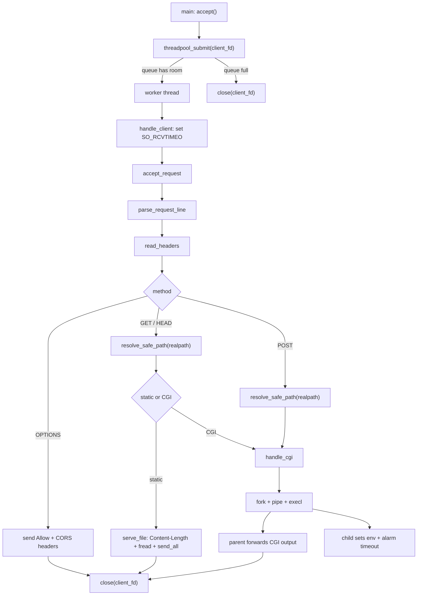

# Tinyhttpd Engineering Retrofit

这是一个**基于 tinyhttpd 的轻量级 HTTP Server 工程化改造项目**，原始代码来自 J. David Blackstone 的教学项目。项目目标是保留 tinyhttpd 的教学可读性，同时补充线程池、基础安全边界、静态文件二进制发送、CGI 处理和集成测试。

它不是生产级 Web Server，也不试图完整实现 HTTP/1.1、TLS、CGI sandbox 或高性能事件驱动架构。

## 已实现功能

### HTTP 方法

- `GET`：读取静态文件或执行 CGI。
- `HEAD`：返回响应头，不返回响应 body。
- `POST`：面向 CGI，读取请求体并通过 stdin 传给 CGI。
- `OPTIONS`：返回 `Allow` 和基础 CORS 相关 header。

### 静态文件服务

- 从 `htdocs/` 目录读取静态文件。
- 根据文件扩展名返回基础 `Content-Type`。
- 返回 `Content-Length`。
- 使用 `fread()` 分块读取文件，并通过 `send_all()` 发送，避免文本读取方式在 `NUL` 字节处截断二进制内容。
- `HEAD` 静态文件响应包含 `Content-Length`，但不发送 body。

### CGI

- 支持 CGI `GET` / `HEAD` / `POST`。
- `GET` / `HEAD` 使用 `QUERY_STRING` 环境变量传递查询参数。
- `POST` 使用 `CONTENT_LENGTH` 环境变量，并将请求体写入 CGI stdin。
- 通过 `pipe + fork + execl` 执行 CGI。
- CGI 子进程设置简单 wall-clock 超时，避免单个 CGI 进程永久占用 worker。
- CGI `HEAD` 只转发 CGI 输出 header，识别 `\n\n` 和 `\r\n\r\n` 作为 header 结束。

### 线程池与任务队列

- 主线程负责 `accept()`。
- 连接 fd 提交到线程池任务队列。
- worker 线程从 FIFO 队列取出 fd 并处理请求。
- 队列满时拒绝新连接，由主线程关闭 socket。
- worker 复用固定线程，替代原始 tinyhttpd 的 pthread-per-request 模型。

### 基础安全与鲁棒性

- 请求行过长返回 `400`。
- 单个 header 行超过缓冲区返回 `400`。
- 请求 header 累计超过 8KB 返回 `413`。
- POST body 通过 `Content-Length` 限制为 1MB，超过返回 `413`。
- POST body 截断或读取异常返回 `400`。
- socket 读取设置 5 秒 `SO_RCVTIMEO`。
- 静态文件和 CGI 路径通过 `realpath()` 校验，最终路径必须位于真实 `htdocs` 根目录下，防止 symlink 逃逸。
- 错误响应使用统一 HTML 错误页格式。

### 集成测试

集成测试脚本位于 `tests/run_integration_tests.sh`，覆盖：

- 基础静态资源 `GET /`。
- 404。
- 静态二进制文件不会因 `NUL` 字节截断。
- 静态文件 GET/HEAD 的 `Content-Length`。
- HEAD 不返回 body。
- CGI GET/HEAD/POST。
- CGI HEAD 不泄露 body。
- OPTIONS。
- header 单行和累计大小限制。
- symlink 指向 `htdocs` 外部时返回 403。
- POST body 截断返回 400。
- CGI 超时后 worker 可继续处理普通请求。

## 请求处理流程



## 编译、运行、测试

### 编译

```bash
make clean && make
```

### 运行

```bash
./httpd
./httpd 8080
```

默认端口是 `8080`。

### 手动请求

```bash
curl -i http://127.0.0.1:8080/
curl -I http://127.0.0.1:8080/
curl -i http://127.0.0.1:8080/date.cgi
curl -i -X POST -d 'a=1' http://127.0.0.1:8080/date.cgi
curl -i -X OPTIONS http://127.0.0.1:8080/
```

## Configuration

服务器启动时会尝试读取 `config/server.conf`。如果配置文件不存在，会使用内置默认值启动。

支持的配置项：

| 配置项 | 默认值 | 说明 |
| --- | --- | --- |
| `port` | `8080` | 监听端口，范围 `1-65535`。 |
| `thread_num` | `4` | 线程池 worker 数量，范围 `1-1024`。 |
| `root_dir` | `./htdocs` | 静态文件和 CGI 的根目录，最大长度 511 字节。 |
| `enable_access_log` | `1` | 是否写入 `logs/access.log`，`1` 开启，`0` 关闭。 |
| `enable_error_log` | `1` | 是否写入 `logs/error.log`，`1` 开启，`0` 关闭。 |

配置文件格式为 `key=value`，会忽略空行和以 `#` 开头的注释。非法配置项会打印 warning，但不会阻止 server 启动；非法数值会保留默认值。

示例：

```conf
# config/server.conf
port=8080
thread_num=8
root_dir=./htdocs
enable_access_log=1
enable_error_log=1
```

命令行端口仍可用于临时覆盖配置文件中的端口：

```bash
./httpd 18080
```

## Logging

服务器会在启动后的请求处理过程中自动创建 `logs/` 目录，并追加写入两个日志文件：

- `logs/access.log`：记录访问日志。
- `logs/error.log`：记录错误日志。

`access.log` 格式：

```text
[YYYY-MM-DD HH:MM:SS] CLIENT_IP "METHOD URL" STATUS
```

示例：

```text
[2026-05-15 12:34:56] 127.0.0.1 "GET /index.html" 200
[2026-05-15 12:35:01] 127.0.0.1 "GET /missing.html" 404
```

`error.log` 格式：

```text
[YYYY-MM-DD HH:MM:SS] ERROR: MESSAGE
```

示例：

```text
[2026-05-15 12:35:01] ERROR: File not found: htdocs/missing.html
[2026-05-15 12:35:10] ERROR: CGI execution failed: /path/to/htdocs/log_fail.cgi
```

日志写入由 `pthread_mutex_t` 保护，避免线程池 worker 并发写入时出现数据竞争或日志行交错。

## Static File MIME Types

静态文件响应会根据文件扩展名设置 `Content-Type`，并包含标准响应头：

```text
HTTP/1.0 200 OK
Content-Type: text/html
Content-Length: 1234
Connection: close
```

支持的 MIME 类型：

| 扩展名 | Content-Type |
| --- | --- |
| `.html`, `.htm` | `text/html` |
| `.css` | `text/css` |
| `.js` | `application/javascript` |
| `.json` | `application/json` |
| `.txt` | `text/plain` |
| `.png` | `image/png` |
| `.jpg`, `.jpeg` | `image/jpeg` |
| `.gif` | `image/gif` |
| `.svg` | `image/svg+xml` |
| `.ico` | `image/x-icon` |
| `.pdf` | `application/pdf` |
| `.bin` | `application/octet-stream` |

未知扩展名和无扩展名文件默认使用 `application/octet-stream`。错误响应也会返回 `Content-Type: text/html`、`Content-Length` 和 `Connection: close`。

### 集成测试

```bash
tests/run_integration_tests.sh
PORT=18081 tests/run_integration_tests.sh
tests/log_test.sh
tests/config_test.sh
tests/mime_test.sh
```

测试脚本会编译项目、启动本地 server、创建临时 fixture、执行测试并清理资源。

## 项目结构

```text
Tinyhttpd/
├── main.c                        # 入口: 加载配置, 启动 server
├── server.c                      # socket/bind/listen/accept 主循环
├── server.h
├── request.c                     # 请求行解析, header 读取
├── request.h
├── response.c                    # 错误响应, 200 header, OPTIONS 响应
├── response.h
├── static_file.c                 # 静态文件读取与发送
├── static_file.h
├── cgi.c                         # CGI: fork/pipe/execl + 超时
├── cgi.h
├── utils.c                       # send_all, get_line, 路径安全校验
├── utils.h
├── log.c                         # access/error 日志 (线程安全)
├── log.h
├── config.c                      # key=value 配置文件解析
├── config.h
├── mime.c                        # 扩展名 → Content-Type 映射
├── mime.h
├── threadpool.c                  # 固定线程池 + FIFO 任务队列
├── threadpool.h
├── simpleclient.c                # 简易 TCP 客户端 (教学用)
├── benchmark.c                   # 多线程压测工具
├── Makefile
├── htdocs/                       # 静态文件和 CGI 脚本
│   ├── index.html
│   ├── index2.html
│   ├── date.cgi
│   ├── check.cgi
│   └── color.cgi
├── tests/
│   ├── run_integration_tests.sh  # 集成测试 (GET/HEAD/POST/OPTIONS/CGI/安全)
│   ├── config_test.sh            # 配置文件解析测试
│   ├── log_test.sh               # 日志写入测试
│   └── mime_test.sh              # Content-Type 测试
├── docs/
├── BENCHMARK.md
├── THREADPOOL_INTEGRATION.md
├── TESTING.md
└── README.md
```

## 线程池接口

```c
void threadpool_init(int thread_count, int max_queue_size, task_handler handler);
int threadpool_submit(int client_fd);
void threadpool_shutdown(void);
int threadpool_get_processed_count(void);
```

当前 server 使用 4 个 worker，任务队列大小为 1000。队列满时 `threadpool_submit()` 返回 `-1`，主线程关闭新连接。

## Limitations

- 不建议生产使用。本项目定位是 tinyhttpd 的工程化改造和 C 网络编程练习。
- 不支持完整 HTTP/1.1：没有 keep-alive、chunked transfer、range request、host-based virtual hosting、完整 header 解析等。
- CGI 超时只是简单的子进程 wall-clock `alarm()`，不是完整 sandbox；不限制 CPU、内存、文件系统、系统调用，也不清理复杂子进程树。
- URL decoding 行为有限：server 当前不做完整 URL decode；路径约束依赖 raw URL 检查和最终 `realpath()` confinement。
- 线程池优雅退出仍不完整：`threadpool_shutdown()` 存在，但主 server 的 `accept()` 循环没有完整信号驱动退出流程。
- 错误处理和 HTTP 语义仍是教学级：例如响应 header 写入、CGI 环境、日志轮转和权限错误分类都还有提升空间。
- benchmark 工具只是简单压测辅助，不代表严谨性能评测。

## 后续可改进方向

- 增加 `SIGINT` / `SIGTERM` 优雅退出。
- 为所有响应发送路径统一使用 `send_all()`。
- 增加 GitHub Actions CI，运行 `make` 和集成测试。
- 增加 sanitizer 构建目标。
- 收敛生成物和日志文件到 `.gitignore`。
- 扩展 URL decode 和路径解析测试。
