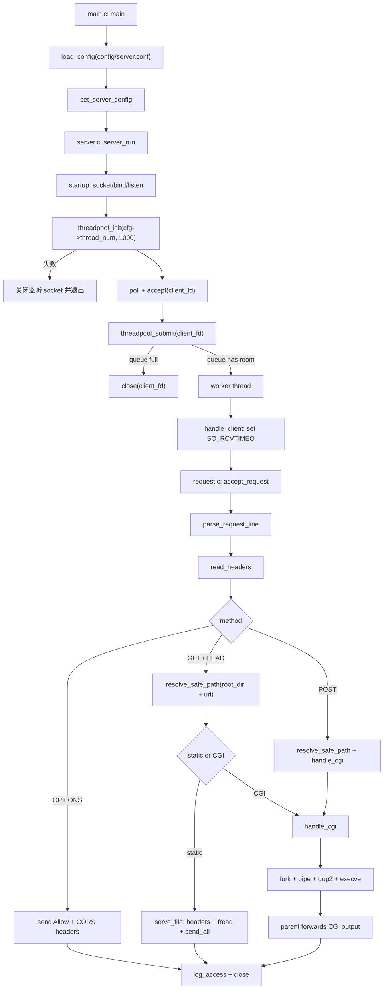

# Tinyhttpd Engineering Retrofit

这是一个基于 J. David Blackstone 的 tinyhttpd 教学项目改造的轻量级 C HTTP Server。项目目标是保留 tinyhttpd 适合学习的代码规模，同时补充更接近工程实践的模块拆分、线程池、配置文件、日志、MIME、基础安全边界、CGI 处理和可复现测试。

它不是生产级 Web Server，也不试图完整实现 HTTP/1.1、TLS、CGI sandbox 或高性能事件驱动架构。

## 已实现功能

### HTTP 方法

- `GET`：读取静态文件或执行 CGI。
- `HEAD`：返回响应头，不返回响应 body。
- `POST`：面向 CGI，读取请求体并通过 stdin 传给 CGI。
- `OPTIONS`：返回 `Allow` 和基础 CORS 相关 header。

### 静态文件服务

- 从配置项 `root_dir` 指定的目录读取静态文件，默认是 `./htdocs`。
- 目录请求会尝试补 `index.html`。
- 根据文件扩展名返回 `Content-Type`。
- 返回 `Content-Length` 和 `Connection: close`。
- 使用 `fread()` 分块读取文件，并通过 `send_all()` 发送，避免因 `NUL` 字节截断二进制内容。
- `HEAD` 静态文件响应只返回 header，不发送 body。

### CGI

- 支持 CGI `GET` / `HEAD` / `POST`。
- `GET` / `HEAD` 使用 `QUERY_STRING` 环境变量传递查询参数。
- `POST` 使用 `CONTENT_LENGTH` 环境变量，并将请求体写入 CGI stdin。
- 通过 `pipe + fork + dup2 + execve` 执行 CGI。
- CGI 子进程设置 5 秒 wall-clock 超时，避免单个 CGI 永久占用 worker。
- CGI `HEAD` 只转发 CGI 输出 header，识别 `\n\n` 和 `\r\n\r\n` 作为 header 结束。
- CGI 非 0 退出会记录错误日志并返回失败状态给调用链；注意如果 CGI 已经输出内容，客户端可能已经收到 `200 OK`，这仍不是完整 CGI 错误语义。
- CGI 环境在 `fork()` 前构造；子进程在 `fork()` 后只进行 fd 重定向、信号设置和 `execve()`，失败使用 `_exit()`。
- CGI pipe、监听 socket、客户端 socket 和 server 打开的文件使用 close-on-exec；fd 创建/标记与 `fork()` 通过同一把短期 mutex 串行化，避免并发继承窗口。

### 线程池与任务队列

- 主线程负责 `accept()`。
- 连接 fd 提交到线程池 FIFO 任务队列。
- worker 线程从队列取出 fd 并调用请求处理函数。
- 队列满时拒绝新连接，由主线程关闭 socket。
- worker 复用固定线程，替代原始 tinyhttpd 的 pthread-per-request 模型。
- worker 数量由配置项 `thread_num` 控制，默认 4；当前线程池实现自身限制为 1 到 100。

### 配置文件

启动时会尝试读取 `config/server.conf`。配置文件不存在时使用内置默认值。

支持的配置项：

| 配置项 | 默认值 | 说明 |
|---|---:|---|
| `port` | `8080` | 监听端口，范围 `1-65535`。 |
| `thread_num` | `4` | 线程池 worker 数，范围 `1-100`。 |
| `root_dir` | `./htdocs` | 静态文件和 CGI 根目录，最大长度 511 字节。 |
| `enable_access_log` | `1` | 是否写入 `logs/access.log`。 |
| `enable_error_log` | `1` | 是否写入 `logs/error.log`。 |

配置格式为 `key=value`，空行和 `#` 注释会被忽略。未知 key 和非法值会打印 warning，但不会阻止 server 启动。

示例：

```conf
# config/server.conf
port=8080
thread_num=8
root_dir=./htdocs
enable_access_log=1
enable_error_log=1
```

命令行端口会覆盖配置文件中的端口：

```bash
./httpd 18080
```

### 日志

服务器会自动创建 `logs/` 目录，并根据配置追加写入：

- `logs/access.log`：访问日志。
- `logs/error.log`：错误日志。

访问日志格式：

```text
[YYYY-MM-DD HH:MM:SS] CLIENT_IP "METHOD URL" STATUS
```

错误日志格式：

```text
[YYYY-MM-DD HH:MM:SS] ERROR: MESSAGE
```

日志写入由 `pthread_mutex_t` 保护，避免多个 worker 并发写入时日志行交错。当前没有实现日志轮转。

### MIME 类型

静态文件响应会根据扩展名设置 `Content-Type`：

| 扩展名 | Content-Type |
|---|---|
| `.html`, `.htm` | `text/html` |
| `.css` | `text/css` |
| `.js` | `application/javascript` |
| `.json` | `application/json` |
| `.txt` | `text/plain` |
| `.png` | `image/png` |
| `.jpg`, `.jpeg` | `image/jpeg` |
| `.gif` | `image/gif` |
| `.svg` | `image/svg+xml` |
| `.ico` | `image/x-icon` |
| `.pdf` | `application/pdf` |
| `.bin` | `application/octet-stream` |

未知扩展名和无扩展名文件默认使用 `application/octet-stream`。错误响应使用 `text/html`。

### 基础安全与鲁棒性

- 请求行过长返回 `400`。
- 单个 header 行超过缓冲区返回 `400`。
- 请求 header 累计超过 8KB 返回 `413`。
- POST body 通过 `Content-Length` 限制为 1MB，超过返回 `413`。
- URI 超过内部 254 字节边界时返回 `414`，不会静默截断到另一个路径。
- 重复 `Content-Length` 被拒绝为 `400`，避免多个长度值产生解析歧义。
- POST body 截断或读取异常返回 `400`。
- socket 读取设置 5 秒 `SO_RCVTIMEO`。
- 静态文件和 CGI 路径通过 `realpath()` 校验，最终路径必须位于配置的真实 `root_dir` 下，防止 symlink 逃逸。
- 静态文件权限不足时返回 `403`。
- 错误响应包含 `Content-Length` 和 `Connection: close`。
- `SIGPIPE` 被忽略，避免客户端断开导致 server 进程退出。
- `SIGINT` / `SIGTERM` 会触发退出流程；主线程通过非阻塞 listener + 250ms `poll()` 周期可靠观察停止标志，再排空并关闭线程池。

## 请求处理流程



## 编译、运行、测试

### 编译

```bash
make clean
make
```

默认使用 C17，并启用 `-Wall -Wextra -Wpedantic -Wconversion -Wshadow`。可通过 `CC`、`CFLAGS` 和 `LDFLAGS` 覆盖编译器及附加选项。

`httpd` 由以下模块编译链接：

```text
main.c server.c request.c response.c static_file.c cgi.c utils.c
log.c config.c mime.c threadpool.c
```

### 运行

使用默认配置启动：

```bash
./httpd
```

临时覆盖端口：

```bash
./httpd 18080
```

### 手动请求

```bash
curl --noproxy '*' -i http://127.0.0.1:8080/
curl --noproxy '*' -I http://127.0.0.1:8080/
curl --noproxy '*' -i http://127.0.0.1:8080/date.cgi
curl --noproxy '*' -i -X POST -d 'a=1' http://127.0.0.1:8080/date.cgi
curl --noproxy '*' -i -X OPTIONS http://127.0.0.1:8080/
```

### 自动化测试

```bash
make unit-test       # 不监听 TCP 端口的边界/生命周期测试
make test            # 构建、单元测试和全部本地集成测试
make sanitizer-test  # ASan + UBSan 构建并运行同一套测试
```

也可以单独运行 shell 测试；例如 `PORT=18081 tests/run_integration_tests.sh`。测试只访问 `127.0.0.1`，不依赖外部网络；fixture、临时输出、后台 server 和端口都会在退出 trap 中清理。若指定端口已被其他进程占用，测试会失败而不会终止该进程。

测试覆盖概要：

- `tests/request_test.c`
  - 超长 URI 返回 414，不发生静默截断。
  - 缺失 URI 和重复 `Content-Length` 返回 400。
  - 最大允许 `Content-Length` 边界。
- `tests/cgi_test.c` / `tests/cgi_fd_probe.c`
  - CGI `exec` 后不继承客户端 socket。
- `tests/threadpool_test.c`
  - 初始化参数、显式失败返回、任务排空和重复 shutdown。

- `tests/run_integration_tests.sh`
  - 基础静态资源 `GET /`。
  - 404。
  - 二进制静态文件不会因 `NUL` 字节截断。
  - 静态文件 GET/HEAD 的 `Content-Length`。
  - HEAD 不返回 body。
  - CGI GET/HEAD/POST。
  - OPTIONS。
  - header 单行和累计大小限制。
  - symlink 指向根目录外部时返回 403。
  - POST body 截断返回 400。
  - CGI 超时后 worker 可继续处理普通请求。
  - worker 忙碌时收到 SIGTERM，server 仍能排空任务并释放端口。
- `tests/log_test.sh`
  - 访问日志格式。
  - 404 错误日志。
  - CGI 失败错误日志。
- `tests/config_test.sh`
  - 配置文件缺失时使用默认值。
  - 自定义端口。
  - 自定义 `root_dir`。
  - 非法配置不导致 server 崩溃。
- `tests/mime_test.sh`
  - 常见扩展名的 `Content-Type`。
  - 未知扩展名默认 `application/octet-stream`。
  - 错误响应包含 `Content-Type` 和 `Content-Length`。

## 项目结构

```text
Tinyhttpd/
├── main.c                        # 入口: 加载配置, 命令行端口覆盖, 启动 server
├── server.c / server.h           # socket/bind/listen/accept, 信号处理, 线程池接入
├── request.c / request.h         # 请求行解析, header 读取, 方法分发, 状态日志
├── response.c / response.h       # 静态响应头, 错误响应, Content-Length
├── static_file.c / static_file.h # 静态文件读取与发送
├── cgi.c / cgi.h                 # CGI: pipe/fork/dup2/execve + 超时
├── utils.c / utils.h             # send_all, get_line, 路径安全校验
├── config.c / config.h           # key=value 配置解析和全局配置
├── log.c / log.h                 # access/error 日志, mutex 保护
├── mime.c / mime.h               # 扩展名到 Content-Type 映射
├── threadpool.c / threadpool.h   # 固定线程池 + FIFO 任务队列
├── simpleclient.c                # 历史 TCP 客户端 demo
├── benchmark.c                   # 简单多线程压测工具
├── Makefile
├── htdocs/                       # 默认静态文件和 CGI 脚本
│   ├── index.html
│   ├── index2.html
│   ├── date.cgi
│   ├── check.cgi
│   └── color.cgi
├── tests/
│   ├── request_test.c            # request/header 边界测试
│   ├── cgi_test.c                # CGI fd 继承回归测试
│   ├── cgi_fd_probe.c            # 被 exec 的 fd 探针
│   ├── threadpool_test.c         # 线程池生命周期测试
│   ├── run_integration_tests.sh
│   ├── config_test.sh
│   ├── log_test.sh
│   └── mime_test.sh
├── .github/workflows/ci.yml      # Ubuntu 普通测试与 sanitizer CI
├── BENCHMARK.md
├── THREADPOOL_INTEGRATION.md     # 当前线程池契约与所有权说明
├── TESTING.md
└── README.md
```

## 线程池接口

```c
int threadpool_init(int thread_count, int max_queue_size, task_handler handler);
int threadpool_submit(int client_fd);
void threadpool_shutdown(void);
int threadpool_get_processed_count(void);
```

当前 server 使用配置项 `thread_num` 作为 worker 数，任务队列大小固定为 1000。初始化失败会关闭监听 socket 并让进程以非 0 状态退出。队列满时 `threadpool_submit()` 返回 `-1`，主线程关闭新连接。shutdown 会停止接收新任务、排空已接受任务并 join 全部 worker。

## CI 与 sanitizer

`.github/workflows/ci.yml` 在 Ubuntu 上执行两个独立 job：

- `make test`：严格编译、单元测试和全部集成测试。
- `make sanitizer-test`：AddressSanitizer + UndefinedBehaviorSanitizer 下运行相同测试。

macOS 的 Apple Clang 不支持 LeakSanitizer，因此本地目标不强制 `detect_leaks`；Ubuntu CI 使用 ASan 的平台默认 leak detection。

## 安全边界

本项目只提供适合教学规模的基础防护，不构成安全隔离：

- `realpath()` confinement 会拒绝最终解析到 `root_dir` 外的路径和已存在的逃逸 symlink。
- CGI 是本机可执行文件，拥有 server 进程本身的文件系统和系统调用权限；没有 chroot、seccomp、资源配额或权限降级。
- 配置文件和 `root_dir` 被视为受信任的本地管理员输入；HTTP 请求是不受信任输入。
- CGI 输出被视为受信任脚本输出，server 不完整解析或重写其 header。

## Benchmark

编译：

```bash
make benchmark
```

使用：

```bash
./benchmark <host> <port> <path> <num_threads> <requests_per_thread>
```

示例：

```bash
./benchmark 127.0.0.1 8080 / 10 100
```

注意：`benchmark` 只是简单辅助工具，只发送 GET，请求成功标准是响应中包含 `200 OK`，不提供延迟分位数、完整响应读取、超时控制或严谨性能结论。

## Limitations

- 不建议生产使用。本项目定位是 tinyhttpd 的工程化改造和 C 网络编程练习。
- 不支持完整 HTTP/1.1：没有 keep-alive、chunked transfer、range request、host-based virtual hosting、完整 header 解析等。
- CGI 超时只是子进程 wall-clock `alarm()`，不是完整 sandbox；不限制 CPU、内存、文件系统、系统调用，也不清理复杂子进程树。
- CGI 如果已经输出部分响应后再以非 0 状态退出，server 会记录错误并返回失败状态给调用链，但客户端可能已经收到 `200 OK`。
- POST CGI 目前先把 body 写入 CGI stdin，再读取 CGI stdout；恶意 CGI 同时大量写 stdout 且不读 stdin 时可能发生 pipe 互等，最终依赖 5 秒超时释放 worker。
- URL decoding 行为有限：server 当前不做完整 URL decode；路径约束依赖 raw URL 检查和最终 `realpath()` confinement。
- 路径检查与随后 `fopen()` / `execve()` 是分离步骤。若不受信任的本地进程能同时修改 document root，仍存在检查后替换目录项的 TOCTOU 窗口；本项目没有实现逐级 `openat()` confinement。
- 日志写入是线程安全追加，但没有日志轮转。
- benchmark 工具只是简单压测辅助，不代表严谨性能评测。

## 后续可改进方向

- 增加 URL decode 和对应路径安全测试。
- 改进 CGI 错误语义，避免脚本失败时客户端已收到 `200 OK`。
- 用 `openat()`/目录 fd 缩小不受信任 document root 下的 TOCTOU 窗口。
- 使用 `poll()` 同时泵送 CGI stdin/stdout，避免双管道互等。
- 增加日志轮转。
- 使用 `sendfile()` 优化静态文件发送。
- 增强 benchmark：完整读取响应、超时、p95/p99、多轮统计。
