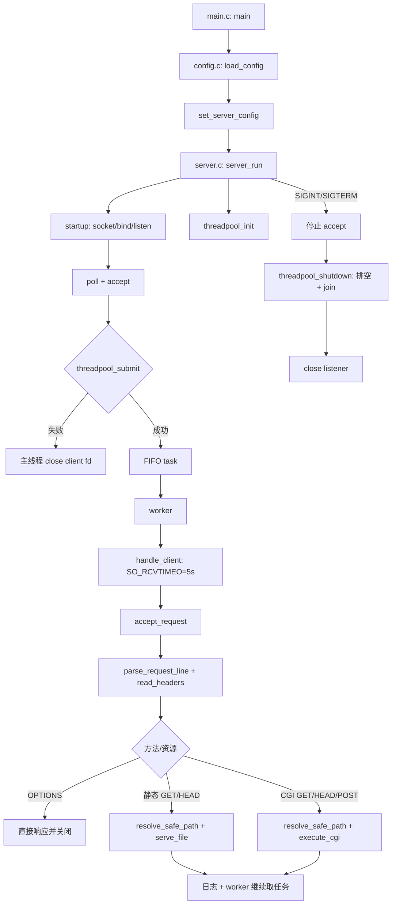

# Tinyhttpd 学习指南

> [!WARNING]
> 历史快照：本文固定描述目录重组前的 `c4de0b8` 布局，文中的根目录文件路径、行号、
> `.codegraph/` 和 `graphify-out/` 统计不代表当前工作区。当前事实请以
> [architecture.md](architecture.md)、[code-walkthrough.md](code-walkthrough.md)、
> [module-guide.md](module-guide.md) 和实际 `src/`、`include/` 为准。

## 0. 阅读约定与证据边界

- 当前 `.codegraph/codegraph.db` 索引了 23 个 C/头文件、195 个节点和 128 条 `calls` 边。它能快速定位调用关系，但库中仍有当前 `threadpool.c` 已不存在的 `task_destroy` 调用边，说明索引与现状并非完全同步。
- 当前 `graphify-out/GRAPH_REPORT.md` 汇总 30 个文件、264 个节点和 504 条边，其中 14% 标记为 `INFERRED`。它把 `server_run()`、`accept_request()`、`execute_cgi()` 等识别为跨模块枢纽，这与源码结构一致；具体控制流仍以对应 `.c` 文件为准。
- 本文未标“推断”的结论都可由当前代码、测试或构建文件直接确认。需要从实现行为进一步推演的内容会明确写成“推断”。
- 文中的 `文件:行号` 指当前基线，后续改代码时行号可能移动，应同时以函数名搜索。

## 1. 项目概览

Tinyhttpd 是一个基于 J. David Blackstone tinyhttpd 改造的轻量级 C HTTP Server。它保留教学项目的小体量，又加入了固定线程池、有界 FIFO 队列、配置、日志、MIME、静态文件、CGI、请求边界检查、安全路径解析、自动化测试、ASan/UBSan 和 CI。

它当前支持：

- `GET`：返回静态文件；URL 带查询串或目标文件有执行位时走 CGI。
- `HEAD`：静态文件只发响应头；CGI 只转发 CGI 头部并丢弃 body。
- `POST`：只按 CGI 路径处理，请求体依据 `Content-Length` 写入 CGI 标准输入。
- `OPTIONS`：返回 `Allow` 与基础 CORS header。
- HTTP 响应统一以 `HTTP/1.0` 状态行开头，连接由服务端处理完成后关闭。

项目的核心学习价值不在“实现完整 HTTP”，而在下面几组工程问题：

1. 如何把监听、解析、响应、文件、CGI、配置、日志和并发拆成可读模块。
2. 如何明确 socket、堆节点、线程、管道、子进程和 `FILE *` 的所有权。
3. 如何在多线程进程中安全地 `fork()`/`execve()`，减少 fd 继承窗口。
4. 如何把边界、防护、清理路径变成可复现测试，而不仅是注释。

明确边界：README 已说明它不是生产级 Web Server；没有完整 HTTP/1.1、TLS、事件驱动 I/O、CGI sandbox、权限隔离或严谨性能测量。

## 2. 目录和模块职责

| 文件/目录 | 核心入口 | 真实职责 |
|---|---|---|
| `main.c` | `main()`、`parse_port()` | 加载配置；解析命令行端口；把配置复制为活动配置；进入 `server_run()`。 |
| `config.c/.h` | `load_config()`、`set_server_config()`、`get_server_config()` | 保存 `server_config_t`；解析 `key=value`；提供进程内只读式全局配置入口。 |
| `server.c/.h` | `startup()`、`server_run()`、`handle_client()` | 创建监听 socket；安装信号处理；`poll()` + `accept()`；接入线程池；为客户端设置接收超时。 |
| `threadpool.c/.h` | `threadpool_init()`、`threadpool_submit()`、`worker()`、`threadpool_shutdown()` | 固定 worker、互斥保护的有界 FIFO、任务排空、线程 join、生命周期串行化。 |
| `request.c/.h` | `accept_request()`、`parse_request_line()`、`read_headers()` | 请求行/header 解析；方法分派；查询串拆分；状态码与访问日志汇合。 |
| `response.c/.h` | `headers()`、`send_error_page()` | 生成静态成功响应头和 400/403/404/413/414/500/501 错误页。 |
| `static_file.c/.h` | `serve_file()`、`cat()` | 用 close-on-exec fd 打开静态文件；以 4 KiB 块发送；处理 HEAD 和打开失败。 |
| `cgi.c/.h` | `handle_cgi()`、`execute_cgi()` | 构造 CGI 环境；创建双管道；`fork`/`dup2`/`execve`；POST body 转发；CGI 输出转发与回收。 |
| `utils.c/.h` | `get_line()`、`send_all()`、`resolve_safe_path()`、fd helpers | 行读取、完整发送、路径约束、阻塞模式、`FD_CLOEXEC`，以及 fd 创建与 fork 的互斥窗口。 |
| `log.c/.h` | `log_access()`、`log_error_message()` | 线程安全地追加 access/error 日志；按配置开关日志。 |
| `mime.c/.h` | `get_mime_type()` | 文件扩展名到 `Content-Type` 的大小写不敏感映射。 |
| `htdocs/` | `index.html`、`*.cgi` | 默认文档根目录；三个 CGI 文件具有可执行位。当前 `date.cgi` 和 `color.cgi` 内容相同，`check.cgi` 依赖 Perl CGI 模块。 |
| `benchmark.c` | `main()`、`send_request()` | 独立的多线程 GET 压测辅助程序，不参与服务端链接。 |
| `simpleclient.c` | `main()` | 历史 TCP 客户端 demo，固定连接 `127.0.0.1:9734`，不是 HTTP 回归测试工具。 |
| `tests/*.c` | 各测试 `main()` | 通过 `socketpair()`、线程和 CGI fd 探针测试解析边界、线程池生命周期、fd 继承。 |
| `tests/*.sh` | 各脚本 | 启动真实 server，验证静态/CGI/配置/日志/MIME/信号/安全边界，并用 trap 还原现场。 |
| `Makefile` | `all`、`unit-test`、`test`、`sanitizer-test` | C17 严格编译；构建三个程序和四个测试二进制；编排普通测试与 Sanitizer 测试。 |
| `.github/workflows/ci.yml` | `build-and-test`、`sanitizers` | Ubuntu 上分别运行 `make test` 和 `make sanitizer-test`。 |
| `.codegraph/` | `codegraph.db` | 本地 C 符号与调用关系索引；当前内容仅作导航。 |
| `graphify-out/` | `GRAPH_REPORT.md`、`graph.json`、`graph.html` | 跨代码、README、测试和说明文档的知识图谱；边有 `EXTRACTED`/`INFERRED` 区分。 |

## 3. 总体架构



这不是 reactor：主线程只负责监听和提交，已接受连接的阻塞读取、文件 I/O、CGI 等待和客户端发送都发生在 worker 中。

## 4. 从 `main()` 开始的执行流程

### 4.1 启动与配置

1. `main()` 在栈上创建 `server_config_t cfg`，调用 `load_config("config/server.conf", &cfg)`（`main.c:29-33`）。
2. `load_config()` 先写入默认值：端口 8080、4 个 worker、`./htdocs`、两类日志开启（`config.c:71-80`）。配置文件不存在不是错误；其他打开失败只打印 warning（`config.c:83-101`）。
3. 配置逐行按 `key=value` 解析。端口限制 1–65535，worker 限制 1–100，日志开关限制 0/1，`root_dir` 必须非空且小于 512 字节（`config.c:103-199`）。
4. 若提供命令行参数，`parse_port()` 解析成功就覆盖配置端口；解析失败时会把端口设置为 8080，而不是保留配置文件端口（`main.c:35-43`）。
5. `set_server_config(&cfg)` 把整个结构体复制到 `config.c` 的静态 `active_config`；之后各模块通过 `get_server_config()` 取得指针（`config.c:18-19,205-222`）。
6. `main()` 调用并直接返回 `server_run(cfg.port)` 的返回值（`main.c:45-46`）。

### 4.2 创建 listener

`server_run()` 先把全局停止标记设为 1，忽略 `SIGPIPE`，并为 `SIGINT`/`SIGTERM` 安装只写 `sig_atomic_t` 的 handler（`server.c:18-24,84-94`）。

`startup()` 的顺序是：

1. `socket(PF_INET, SOCK_STREAM, 0)` 创建 IPv4 TCP socket。
2. 设置 `FD_CLOEXEC`，再将 listener 设为非阻塞。
3. 设置 `SO_REUSEADDR`。
4. `bind()` 到 `INADDR_ANY` 和给定端口。
5. 若端口为 0则用 `getsockname()` 回填动态端口；正常配置和命令行不会给出 0，但公共函数保留了能力。
6. `listen(httpd, 5)`，内核 accept backlog 为 5（`server.c:35-72`）。

这些系统调用失败时大多进入 `error_die()`，它执行 `perror()` 后 `exit(1)`（`utils.c:190-194`）。

### 4.3 初始化线程池

`server_run()` 用 `cfg->thread_num`、固定队列容量 `DEFAULT_QUEUE_SIZE=1000` 和处理器 `handle_client` 初始化线程池（`server.c:99`，`threadpool.h:4`）。失败时打印错误、关闭 listener、返回 1（`server.c:99-104`）。

`threadpool_init()`：

- 先验证 worker 数、队列容量和 handler。
- 用 `lifecycle_mutex` 防止初始化、提交、关闭交叉。
- 初始化队列 mutex、condition variable 和线程数组。
- 逐一创建 worker；中途失败会设置 shutdown、唤醒并 join 已创建线程，然后释放所有已初始化资源（`threadpool.c:91-157`）。

### 4.4 `poll()`、`accept()` 与任务提交

主循环每 250ms 对 listener 做一次 `poll()`（`server.c:109-129`）。这样即使信号没有让某次系统调用永久中断，主线程也会在最多约一个 poll 周期后重新检查 `running`。

listener 可读后，`accept_cloexec_blocking()`：

- 在 `fork_fd_mutex` 下执行 `accept()`；
- 给新 client fd 设置 `FD_CLOEXEC`；
- 清除从 listener 语义中可能带来的非阻塞标志，使 client fd 为阻塞模式；
- 设置失败就关闭 client fd 并保留原始 `errno`（`utils.c:29-46`）。

`threadpool_submit(client_sock)` 成功后，连接 fd 的处理责任转给队列/worker；失败时 `server_run()` 关闭该 fd（`server.c:147-149`）。失败原因可能是未初始化、正在关闭、队列已满或任务节点 `malloc()` 失败（`threadpool.c:159-204`）。

### 4.5 worker 到请求处理

worker 在 `pool.mutex` 下等待条件变量；取任务时更新 `head`、`tail`、`task_count`，随后解锁并调用 handler（`threadpool.c:43-75`）。handler 是 `handle_client()`：

1. 尝试给 client socket 设置 5 秒 `SO_RCVTIMEO`；返回值当前未检查。
2. 调用 `accept_request(client)`（`server.c:26-33`）。

任务完成后 worker 释放任务节点，并以 relaxed 原子操作增加 `processed_count`。每完成 100 个任务向 stderr 报告一次（`threadpool.c:69-74`）。

### 4.6 停止与排空

收到 `SIGINT`/`SIGTERM` 时 handler 只做 `running=0`。主循环退出后：

1. `threadpool_shutdown()` 设置 `pool.shutdown=1` 并广播条件变量。
2. worker 在队列非空时继续处理；只有“队列为空且 shutdown”为真才退出。
3. 主线程 join 全部 worker。
4. 释放残余任务节点、线程数组、condition variable 和 queue mutex，重置单例状态。
5. `server_run()` 最后关闭 listener 并返回 0（`threadpool.c:212-243`，`server.c:152-155`）。

因此这里的“优雅关闭”是停止接收新连接、排空已提交连接；它没有单独的全局关停超时。

## 5. 请求解析和方法分派

### 5.1 请求行

`parse_request_line()` 使用 1024 字节行缓冲区，通过 `get_line()` 兼容 `\n`、`\r\n` 和单独 `\r`（`request.c:172-247`，`utils.c:196-249`）。关键边界是：

- 请求行填满 1023 字节且没有换行：400。
- 方法写不进调用者缓冲区或不是 GET/POST/HEAD/OPTIONS：501。
- URL 写不进 255 字节数组：414，即当前最大可存 URL 为 254 字节含结尾 `\0` 之前的内容。
- URL 为空或不以 `/` 开头：400。
- 当前不验证 HTTP 版本字段，也不要求版本字段存在。

解析失败若有正状态码，`accept_request()` 记录 access log；底层读超时/EOF 等返回 `-1` 时直接关闭，不生成状态响应或 access log（`request.c:60-67`）。

### 5.2 Header

`read_headers()` 逐行读取到空行（`request.c:249-323`）：

- 单行缓冲区 1024 字节；过长且未遇换行时返回 400。
- 累计 header 字节数大于 8 KiB 时返回 413。
- `Content-Length` 大小写不敏感；重复出现返回 400。
- 长度必须是非负十进制数，且不能超过 1 MiB；非法值返回 400，过大返回 413。
- 除 `Content-Length` 外，其他 header 当前都被读取并丢弃。

### 5.3 分派规则

| 输入 | 判定 | 后续 |
|---|---|---|
| `OPTIONS` | 读完 headers 后直接处理 | 返回 200、`Allow`、三个 CORS header，记录 access log，关闭连接。 |
| `GET`/`HEAD`，URL 含 `?` | 在原 URL 数组中把 `?` 改为 `\0` | 路径部分用于安全解析，后半段作为 `QUERY_STRING`，强制 CGI。 |
| `GET`/`HEAD`，目标文件任意执行位存在 | `st_mode` 检查 `S_IXUSR/S_IXGRP/S_IXOTH` | CGI。是否执行由文件权限而不是 `.cgi` 扩展名决定。 |
| `GET`/`HEAD`，无查询串且不可执行 | 普通文件 | 静态文件路径。 |
| `POST` | 请求一开始即设置 `cgi=1` | 安全解析整个 URL 后进入 CGI；必须有合法 `Content-Length`。 |

`POST` 分支没有像 GET/HEAD 一样拆分 `?query`，而且 CGI 环境只设置 `CONTENT_LENGTH`，不设置 `QUERY_STRING`（`request.c:154-169`，`cgi.c:58-83`）。这是当前实现行为，不是完整 CGI 语义。

## 6. 核心数据结构及生命周期

### 6.1 `server_config_t`

```c
typedef struct {
    uint16_t port;
    int thread_num;
    char root_dir[512];
    int enable_access_log;
    int enable_error_log;
} server_config_t;
```

生命周期：`main()` 栈对象 → `load_config()` 填充 → 命令行覆盖 → 按值复制到静态 `active_config` → server 启动后各线程只读取。当前没有运行期 reload，因此代码没有为配置对象加锁。

### 6.2 `threadpool_task_t`

```c
typedef struct threadpool_task {
    int client_fd;
    struct threadpool_task *next;
} threadpool_task_t;
```

生命周期：`threadpool_submit()` 中 `malloc()` → 追加到 FIFO 尾部 → worker 从头部摘除 → handler 处理 fd → `free(task)`。任务节点只拥有一个 fd 值；fd 的关闭由请求处理器负责。

### 6.3 `threadpool_t`

包含队列头尾、任务数、容量、shutdown/initialized 状态、queue mutex、condition variable、线程数组、线程数和函数指针（`threadpool.c:14-28`）。它是进程级静态单例：

- `lifecycle_mutex`：保护 init/submit/shutdown 之间的生命周期，不让 submit 与 mutex 销毁并发。
- `pool.mutex`：保护 `head`、`tail`、`task_count` 和 `shutdown`。
- `task_available`：让空闲 worker 休眠并在提交/关闭时唤醒。
- `processed_count`：使用 relaxed 原子，仅用于统计，不参与调度正确性。

### 6.4 client fd 的所有权

```text
accept 成功：server 主线程拥有 client_fd
  ├─ submit 失败：server 主线程 close
  └─ submit 成功：任务队列/worker 接管
       └─ accept_request
          ├─ 解析/header/OPTIONS 错误路径：accept_request close
          ├─ 静态路径：serve_file close
          └─ CGI 路径：handle_cgi/execute_cgi close
```

`handle_client()` 本身不关闭 fd；它依赖 `accept_request()` 的所有返回路径履行关闭契约。线程池 shutdown 中释放残余任务节点时没有关闭其中 fd，但正常不变量是 worker 在退出前排空队列，因此该循环应只处理异常残留。

### 6.5 静态文件资源

`serve_file()` 用 `open_cloexec()` 得到 fd，再用 `fdopen()` 包装成 `FILE *`。失败时保留 `errno`，关闭已打开 fd；成功后 `fclose(resource)` 同时关闭底层 fd，最后关闭 client（`static_file.c:28-59`）。

### 6.6 CGI 资源

- `cgi_env`：父进程在 fork 前 `malloc()` 指针数组；fork 失败或父分支立即 `free()`。环境字符串本身来自父进程 `environ` 或栈缓冲区，不单独复制。
- `cgi_output[2]`：子进程 stdout → 父进程读取。
- `cgi_input[2]`：父进程写入 POST body → 子进程 stdin。
- 子进程：`dup2()` 后关闭四个原 pipe fd 和 client fd，再关闭 3 到 `_SC_OPEN_MAX-1` 的其他 fd，重置 `SIGPIPE`/`SIGALRM`，设置 5 秒 alarm，`execve()`。
- 父进程：关闭不用的 pipe 端；必要时传 POST body；读 CGI 输出；关闭 pipe；`waitpid()` 回收子进程；关闭 client。
- POST body 截断或 pipe 写失败：`terminate_cgi_child()` 关闭 pipe、`SIGKILL` 子进程并 `waitpid()`，防止僵尸进程（`cgi.c:134-145,307-337`）。

## 7. 关键调用链和数据流

### 7.1 静态 GET

```text
worker
→ handle_client(fd)
→ accept_request(fd)
→ parse_request_line
→ read_headers
→ resolve_safe_path(url)
→ handle_static_file
→ serve_file
→ open_cloexec + fdopen
→ headers(Content-Type, Content-Length, Connection: close)
→ cat: fread(4 KiB) + send_all
→ fclose(file) + close(client)
→ log_request_error(仅 403/404/500) + log_access
```

数据从文件进入 4096 字节栈缓冲区，再由 `send_all()` 处理短写和 `EINTR`。它按实际 `fread()` 长度发送，因此二进制 NUL 不会截断。

### 7.2 静态 HEAD

链路与静态 GET 相同，但 `serve_file()` 只调用 `headers()`，不调用 `cat()`。`Content-Length` 来自安全路径解析时得到的 `stat.st_size`。

### 7.3 CGI GET/HEAD

```text
accept_request
→ 从 URL 拆 QUERY_STRING（若有）
→ resolve_safe_path
→ handle_cgi
→ build_cgi_environment
→ fork_with_cloexec_pipes
  ├─ child: dup2 → close fds → alarm(5) → execve
  └─ parent: close stdin pipe → read CGI stdout
       ├─ GET: 转发全部 CGI header + body
       └─ HEAD: 转发到 \n\n 或 \r\n\r\n，余下内容只读取不发送
→ waitpid
→ close(client)
→ accept_request 记录状态日志
```

服务端在确认 CGI 至少输出 1 字节后先发送自己的 `HTTP/1.0 200 OK` 和 `Server` header，再转发 CGI 输出（`cgi.c:342-393`）。

### 7.4 CGI POST

```text
客户端 socket
→ read_headers 得到 Content-Length（上限 1 MiB）
→ parent 每次 recv 最多 1024 字节
→ write_all_fd(cgi_input[1])
→ child stdin
→ CGI 程序
→ child stdout
→ cgi_output[0]
→ parent 按字节读取
→ send_all(client)
```

进入 body 转发前，父进程把 socket 接收超时从 5 秒改为 1 秒（`cgi.c:307-316`）。完整 body 写完后关闭 pipe 写端，CGI 才能看到 EOF。

### 7.5 错误与日志数据流

- 解析函数或路径函数先发送 HTTP 错误响应并返回状态码。
- `accept_request()` 在可识别的错误状态上调用 `log_access()`；403/404/500 还经 `log_request_error()` 写 error log。
- 静态/CGI handler 自己关闭 client，然后把状态码返回给 `accept_request()` 记录日志。
- 日志函数每次写入都在 `log_mutex` 下创建 `logs/`、以追加方式打开文件、写一行并关闭文件。

## 8. 网络设计

- IPv4 TCP，listener 绑定 `INADDR_ANY`，即所有本机 IPv4 地址，而不仅是 `127.0.0.1`。
- listener 为非阻塞，主循环以 250ms `poll()` 检查可读与关停；accepted client 被显式改回阻塞。
- listener backlog 为 5，应用层任务队列容量为 1000，两者是不同层的排队限制。
- worker 对读操作设置 5 秒 socket 超时；POST body 阶段缩短为 1 秒。
- `send_all()` 处理短写和 `EINTR`，但没有发送超时。
- server 每个连接只处理一个请求，发送 `Connection: close` 的静态/错误响应并主动关闭；没有 keep-alive。
- `SIGPIPE` 在 server 进程中忽略，避免向已断开的客户端或 pipe 写入时终止整个进程。CGI 子进程在 exec 前恢复默认 `SIGPIPE`。

## 9. 并发设计

### 9.1 线程模型

- 1 个主线程：信号可观察的 accept 循环和任务提交。
- 1–100 个固定 worker：阻塞处理客户端连接。
- 每个 CGI 请求额外 fork 1 个子进程。

与“一请求一线程”相比，固定池限制了 server 线程数；代价是所有 worker 都被慢客户端或 CGI 占用时，新任务会在最大 1000 的队列中等待。

### 9.2 三把关键 mutex

| mutex | 保护对象 | 不能混淆的点 |
|---|---|---|
| `lifecycle_mutex` | 线程池 init/submit/shutdown 生命周期 | submit 持有它直到任务入队，shutdown 持有它直到 join 和销毁完成。 |
| `pool.mutex` | FIFO 和 shutdown 状态 | worker 等条件变量时会原子地释放它。 |
| `log_mutex` | 日志目录创建和单行追加 | access/error 共用，确保日志行不交错。 |
| `fork_fd_mutex` | 可被 CGI fork 观察到的 fd 创建/标记与 fork 窗口 | `accept`、pipe、server 打开的文件与 fork 共用。 |

`fork_with_cloexec_pipes()` 在父进程和 fork 失败时解锁；子进程保留其地址空间中的锁定副本，随后只做 async-signal-safe 风格的 fd/信号操作并 `execve()`/`_exit()`，不再调用会获取该 mutex 的项目函数。

### 9.3 关闭语义

shutdown 不丢弃已经成功提交的任务。worker 的退出条件是：

```c
pool.task_count == 0 && pool.shutdown
```

因此忙 worker 会完成当前任务，空闲 worker 被广播唤醒，队列任务被继续消费，主线程等待全部 join。集成测试专门用慢 CGI + `SIGTERM` 验证这条路径。

## 10. 文件与资源管理

### 10.1 close-on-exec 策略

下列 server 自己创建/接受的 fd 会标记 `FD_CLOEXEC`：

- listener；
- accepted client socket；
- 两对 CGI pipe；
- 静态文件 fd；
- access/error 日志 fd。

此外 CGI 子进程在 `execve()` 前主动关闭 3 以上的所有 fd。`tests/cgi_test.c` 同步启动 16 个 CGI，并用 `cgi_fd_probe` 验证 exec 后 fd 3–255 范围没有无关描述符。

### 10.2 路径处理

`resolve_safe_path()` 的顺序（`utils.c:251-343`）：

1. 按 `/` 切路径组件，任何恰为 `..` 的组件直接 403。
2. `realpath(root_dir)` 得到真实文档根。
3. 拼接 `root_dir + raw_url`，检查目标缓冲区溢出。
4. 末尾 `/` 补 `index.html`；若 `stat()` 得到目录再补 `/index.html`。
5. `realpath(target)` 跟随 symlink 得到最终目标。
6. 要求最终路径等于 docroot 或以 `docroot/` 为前缀，否则 403。
7. 把真实绝对路径复制回调用者缓冲区。

这同时覆盖了显式 `..` 和最终 symlink 逃逸，但不做 URL percent decoding。

### 10.3 日志文件

`open_log_file()` 使用 `O_WRONLY|O_CREAT|O_APPEND`、权限 0644 和 `FD_CLOEXEC`，再 `fdopen(..., "a")`。目录权限为 0755。打开、创建或写入失败不会传播到请求状态。

## 11. 安全设计与信任边界

已实现的基础防护：

- 请求行、单个 header、累计 headers、URI 和 POST body 都有限制。
- 拒绝重复 `Content-Length`，减少长度解释歧义。
- 截断 POST body 返回 400，并强杀、回收对应 CGI 子进程。
- raw path 的 `..` 检查和最终 `realpath()` confinement 防止常见目录穿越与 symlink 逃逸。
- listener 在 worker 启动前完成 close-on-exec 标记；运行期的 accept、pipe、静态/日志文件打开则与 fork 共用互斥协议，减少“创建后、标记前”被子进程继承的窗口。
- CGI wall-clock alarm 为 5 秒，客户端 header 读取超时为 5 秒，POST body 读取超时为 1 秒。
- 忽略 server 的 `SIGPIPE`，避免单客户端断开拖垮进程。
- CGI 环境中父环境已有的 `REQUEST_METHOD`、`QUERY_STRING`、`CONTENT_LENGTH` 会被剔除，再写入本次请求值。

信任边界：

- HTTP 请求是不受信任输入。
- 配置文件、`root_dir` 及其本地内容被当作管理员可控输入。
- 任意有执行位的目标文件被当成受信任 CGI 程序。
- CGI 输出被直接转发，server 不完整解析、校验或规范化 CGI headers。
- CGI 继承父进程除三个 CGI 变量以外的环境。因此 server 环境中的令牌、路径或其他敏感变量也可能对 CGI 可见。

推断：由于访问日志直接写入 method/URL，代码没有显式过滤非空白控制字符，恶意请求可能污染终端或日志展示；当前测试没有覆盖这一点。

## 12. 错误处理与清理路径

| 位置/失败 | 对客户端 | 资源清理 | 进程结果 |
|---|---|---|---|
| 配置文件不存在 | 无 | 使用默认配置 | 继续启动。 |
| 配置行非法 | 无 | 对应项回默认值或忽略 | warning 后继续。 |
| `socket`/fcntl/setsockopt/bind/listen/accept 致命错误 | 可能尚无客户端响应 | `exit()` 后由 OS 回收进程资源 | 立即退出 1。 |
| 线程池初始化失败 | 无 | 初始化函数清理部分资源；`server_run()` 关闭 listener | 返回 1。 |
| `poll()` 非 EINTR 错误或 listener 错误事件 | 不再接受 | 排空线程池，关闭 listener | 返回 0。 |
| 任务队列满/任务 malloc 失败 | 无 HTTP 503 | 主线程关闭新 client fd | server 继续。 |
| 请求行/header 可识别错误 | 400/413/414/501 | `accept_request()` 关闭 client | worker 继续。 |
| socket EOF/timeout 导致解析返回 -1 | 通常无响应 | 关闭 client | worker 继续。 |
| 路径不存在/越界/根不可用 | 404/403/500 | 调用者记录日志并关闭 client | worker 继续。 |
| 静态文件打开失败 | 403 或 404 | 关闭已打开 fd/`FILE *` 和 client | 返回状态给日志链。 |
| CGI 环境或 pipe/fork 失败 | 500 | 释放环境、pipe helper 清理已建 pipe、关闭 client | worker 继续。 |
| POST body 截断 | 400 | 关闭 pipe、kill + wait 子进程、关闭 client | worker 继续。 |
| 写 CGI stdin 失败 | 500 | 关闭 pipe、kill + wait 子进程、关闭 client | worker 继续。 |
| CGI 无输出 | 500 | 关闭 output pipe、wait 子进程、关闭 client | worker 继续。 |
| CGI 非 0 退出 | 客户端可能已收到 200/部分响应 | 关闭 pipe、wait 子进程、关闭 client | access log 记录 500。 |
| SIGINT/SIGTERM | 停止新 accept | 排空任务、join worker、关闭 listener | 正常返回 0。 |

值得注意的错误语义：

- `headers()`、`send_error_page()` 和 OPTIONS 多数不检查 `send_all()` 返回值。
- `cat()` 在发送失败时停止读文件，但 `serve_file()` 仍返回 200；access log 可能记录 200。
- 日志失败是静默的，不会影响 HTTP 状态。
- `setsockopt(SO_RCVTIMEO)` 失败被忽略。
- accept 的非预期错误走 `error_die()`，不会先执行线程池排空。

## 13. 构建、运行、测试、Sanitizer 与 CI

### 13.1 前置条件

- POSIX 环境、C 编译器、`make`、pthread。
- 完整 shell 集成测试还需要 Bash、`curl`、`nc`、Perl 及常见工具 `grep`/`cmp`。
- 默认 CGI 脚本需要 `/bin/bash`、`date`；`htdocs/check.cgi` 另外需要 Perl `CGI` 模块。

### 13.2 构建

```bash
make clean
make
```

`all` 构建：

- `httpd`：11 个 server 模块，链接 pthread。
- `client`：只由 `simpleclient.c` 构建。
- `benchmark`：只由 `benchmark.c` 构建，链接 pthread。

默认 `CFLAGS=-O2 -g`，叠加 `-std=c17 -Wall -Wextra -Wpedantic -Wconversion -Wshadow`，并定义 `_XOPEN_SOURCE=700`。

### 13.3 手动运行

终端 A：

```bash
./httpd 18082
```

终端 B：

```bash
curl --noproxy '*' -i http://127.0.0.1:18082/
curl --noproxy '*' -I http://127.0.0.1:18082/
curl --noproxy '*' -i http://127.0.0.1:18082/date.cgi
curl --noproxy '*' -i -X POST -d 'a=1' http://127.0.0.1:18082/date.cgi
curl --noproxy '*' -i -X OPTIONS http://127.0.0.1:18082/
```

用 Ctrl-C 停止。配置文件路径固定为 `config/server.conf`；文件不存在时使用默认值。命令行端口优先于配置端口。

### 13.4 测试层次

| 命令 | 范围 | 关键覆盖 |
|---|---|---|
| `make unit-test` | 四个本地测试二进制，不监听 TCP | URI/header/Content-Length 边界；16 路并发 CGI fd 继承；线程池参数、排空、计数、重复 shutdown。 |
| `make test` | 构建 + unit + 四个 shell suite | 静态/二进制/HEAD；CGI GET/HEAD/POST/超时；OPTIONS；header 上限；symlink 逃逸；截断 body；信号排空；配置、日志、MIME。 |
| `make sanitizer-test` | 清理后用 ASan+UBSan 重建并跑同一套测试 | `-fsanitize=address,undefined -fno-omit-frame-pointer`；错误即停止。 |

测试实现要点：

- `tests/request_test.c` 用 `socketpair()` 向解析函数注入请求，不依赖 TCP 端口。
- `tests/threadpool_test.c` 用 8 对 socket 验证 accepted tasks 在 shutdown 时全部处理。
- `tests/cgi_test.c` 用 16 个同步线程并发 fork/exec `cgi_fd_probe`，检查 fd 3–255。
- `tests/run_integration_tests.sh` 在临时 docroot 中创建二进制、symlink、CRLF CGI 和 10 秒慢 CGI；trap 负责 server、配置、日志和临时目录清理。
- `config_test.sh`、`log_test.sh`、`mime_test.sh` 都会备份并恢复已有配置和日志路径。

### 13.5 Sanitizer 与本次实测

当前 Makefile 启用 AddressSanitizer 和 UndefinedBehaviorSanitizer，没有启用 ThreadSanitizer。README/TESTING 说明 Apple Clang 在 macOS 不提供 LeakSanitizer；Ubuntu CI 使用 ASan 的平台默认能力。

2026-07-14 在当前基线上实测：

```text
make test            PASS
make sanitizer-test  PASS
```

两次均通过全部 C 测试和四个 shell 集成测试；Sanitizer 运行未报告 ASan/UBSan 错误。

### 13.6 CI

`.github/workflows/ci.yml` 对每次 push 和 pull request 运行两个独立 Ubuntu job：

1. `build-and-test`：安装 `netcat-openbsd`，执行 `make test`。
2. `sanitizers`：安装 `netcat-openbsd`，执行 `make sanitizer-test`。

两者权限为 `contents: read`，单 job 超时 10 分钟。CI 不访问外部测试服务，只在安装依赖阶段访问 Ubuntu 包源。

## 14. 当前限制与风险

### 14.1 高优先级

1. **CGI 没有 sandbox。** CGI 拥有 server 进程权限，可访问其文件系统、系统调用和绝大多数环境变量；没有 chroot、seccomp、uid/gid 降权、CPU/内存配额。
2. **CGI 双管道可能互等。** POST parent 先完整写 stdin，再读 stdout；若恶意 CGI 先大量写 stdout 又不读 stdin，两个 pipe 可能互相阻塞。直接 CGI 子进程有 5 秒 alarm，但复杂后代进程树不受完整管理。
3. **路径检查存在 TOCTOU。** `stat()`/`realpath()` 与随后 `open()`/`execve()` 分离；本地不受信任进程若能修改 docroot，可能在检查后替换目录项。更强方案是目录 fd + `openat()` 逐级约束。
4. **CGI 状态语义可能自相矛盾。** server 在完整获知 CGI 退出状态前发送 200；脚本随后失败时客户端可能收到 200，而 access log 记录 500。

### 14.2 协议和边界

- 不支持完整 HTTP/1.1：无 keep-alive、chunked transfer、Range、Host 虚拟主机、Expect/100-continue、完整 header 语义。
- 不验证请求行 HTTP 版本；除 `Content-Length` 外忽略请求 headers。
- 不做 percent decoding。GET/HEAD 只按原始 `?` 拆查询串；POST 不拆查询串。
- OPTIONS 响应当前没有 `Content-Length` 和 `Connection: close` header，虽然处理完会关闭 socket。
- 没有 TLS、认证、授权、请求速率限制。
- listener backlog 只有 5；应用队列满时直接关闭新连接，不返回 503 或 `Retry-After`。

### 14.3 并发和可用性

- 阻塞式 worker 模型下，慢客户端、慢磁盘、慢日志或 CGI 都会占用整个 worker。
- 只有接收超时，没有发送超时；不读取响应的客户端可能长期阻塞 worker 的 `send()`。
- shutdown 会无限等待已接收任务完成；正常 CGI 有 alarm，但静态发送或复杂 CGI 后代仍可能拖延。
- 全局配置、全局线程池和全局 mutex 便于教学，但限制多实例、热重载和隔离测试。
- 没有 ThreadSanitizer、模糊测试或长时间压力/故障注入证明并发无竞态。

### 14.4 文件、日志和可观测性

- 静态响应的 `Content-Length` 来自先前 `stat()`；文件随后变化时 header 和实际 body 可能不一致。
- 多数响应发送失败不会向上准确传播，日志状态可能高估成功率。
- 日志每条请求都 open/write/close，并由一把全局 mutex 串行化；没有轮转、结构化字段或写失败告警。
- CGI 输出按单字节 read/send 转发，效率较低。
- 子进程关闭 3 到 `_SC_OPEN_MAX` 的所有 fd，安全直观但 fd 上限大时成本高。

### 14.5 测试和工具边界

- 当前测试没有直接覆盖队列满时的 server 行为、`send_all()` 失败、日志磁盘失败、线程创建中途失败、encoded traversal、TOCTOU 或恶意 CGI 双管道互等。
- `cgi_fd_probe` 只检查 fd 3–255；CGI 子进程实现会关到 `_SC_OPEN_MAX`，但测试观察范围较窄。
- `benchmark` 只发送 GET，只读响应的第一个 1 KiB，并以其中含 `200 OK` 为成功；没有超时、完整响应验证、p95/p99 或多轮统计，不应据此下严谨性能结论。
- `simpleclient` 是固定 9734 端口的单字节 demo，不适合验证本 server。

推断：若下一轮工程化只选三项，优先级应是 CGI 隔离/双向非阻塞泵送、`openat()` 路径约束、发送超时与错误传播，因为它们分别对应最高安全边界、死锁可用性和结果可信度风险。

## 15. 面试高频问题及参考回答

### Q1：这个项目的整体架构是什么？

主线程用非阻塞 listener 加 250ms `poll()` 接受连接，把 fd 放入容量 1000 的有界 FIFO。固定 worker 阻塞处理请求，解析后分派到静态文件或 CGI；配置、日志、MIME、响应和路径安全独立成模块。SIGINT/SIGTERM 停止 accept 后，线程池排空并 join。

### Q2：为什么用线程池，不用每请求创建线程？

固定池把线程数限制在配置的 1–100，避免请求突发导致无界线程创建；FIFO 复用 worker。代价是阻塞任务会占用 worker，队列满时当前实现只能关闭新连接。

### Q3：连接 fd 的所有权如何转移？

accept 成功后主线程拥有 fd；submit 失败仍由主线程 close；submit 成功后交给队列/worker。请求解析错误由 `accept_request()` close，静态路径由 `serve_file()` close，CGI 路径由 `execute_cgi()` close。线程池只管理任务节点，不替 handler 关闭连接。

### Q4：shutdown 为什么能排空任务？

shutdown 只设置标记并广播。worker 只在“队列为空且 shutdown”为真时退出；队列非空会继续消费。主线程 join 全部 worker 后才销毁同步原语和关闭 listener。

### Q5：如何避免多线程 fork 时 fd 泄漏到 CGI？

项目把 accept、pipe、静态/日志文件打开和 fork 放在同一 `fork_fd_mutex` 协议下，创建后立刻设置 `FD_CLOEXEC`。CGI 子进程还在 exec 前关闭所有 3 以上 fd。16 路并发测试用探针验证 fd 3–255 未泄漏。

### Q6：请求边界如何控制？

请求行 1024 字节缓冲，URL 最多 254 字节；单 header 行最多 1023 字节，累计 headers 不超过 8 KiB；POST `Content-Length` 不超过 1 MiB；重复或非法长度返回 400，过大返回 413。

### Q7：路径穿越如何防？

先拒绝 raw URL 中独立的 `..` 组件，再对 docroot 和目标做 `realpath()`，要求最终路径位于真实 docroot 下，因此已存在的逃逸 symlink 会被拒绝。局限是不做 URL decode，且检查与 open/exec 分离，仍有本地 TOCTOU 窗口。

### Q8：CGI POST 的数据怎么走？

header 解析得到 `Content-Length`；parent 从 client socket 分块 recv，完整写入 CGI stdin pipe；child 的 stdin/stdout 通过 `dup2()` 接到两条 pipe；body 完成后 parent 关闭输入 pipe，再读取 CGI stdout 并转发客户端，最后 waitpid。

### Q9：CGI 为什么可能死锁？怎么改？

当前 POST 先写完 stdin 再读 stdout。若 CGI 同时大量写 stdout 且不读 stdin，两端 pipe 都可能满。可把 client、CGI stdin、CGI stdout 设为非阻塞，用 `poll()`/`select()` 同时泵送，并设置总超时和输出上限。

### Q10：HEAD 如何保证没有 body？

静态 HEAD 发送正常 `Content-Length`，但跳过 `cat()`。CGI HEAD 持续转发到 `\n\n` 或 `\r\n\r\n` 的 header 终点，之后仍读取 CGI 输出以免堵住子进程，但不再发给客户端。

### Q11：`send_all()` 解决了什么？

`send()` 可能短写或被信号打断。`send_all()` 循环到全部字节发送完，遇到 EINTR 重试，0 或其他错误失败。现有不足是多数上层没有传播失败，且没有发送超时。

### Q12：为什么配置可以无锁读取？

当前 `main()` 在创建 worker 前把栈配置按值复制到静态 `active_config`，运行期不修改也不 reload；因此 worker 只读。若增加热更新，就需要不可变快照、读写锁或原子指针切换。

### Q13：日志如何保证线程安全？

access/error 共用 `log_mutex`，每次在锁内确保目录存在、追加打开、写完整一行、关闭。优点是简单且行不交错；缺点是全局串行、每次 open/close、无轮转且错误静默。

### Q14：测试策略有什么层次？

C 测试用 socketpair 和本地进程验证纯边界和生命周期；shell 集成测试启动真实 TCP server 验证端到端行为；同一套测试再由 ASan/UBSan 重跑；GitHub Actions 在 Ubuntu 上拆成普通和 Sanitizer 两个 job。

### Q15：为什么不能说这个 server 是生产级？

因为协议不完整、阻塞 I/O、CGI 无 sandbox、无 TLS/鉴权/限流、路径仍有 TOCTOU、发送错误语义不完整、无日志轮转和生产观测，也没有 TSan/fuzz/长期压测证明。

### Q16：如果只允许做一个改进，你会选什么？

参考回答：先重构 CGI 执行器，用非阻塞双向 `poll()` 泵送并引入可控环境、输出上限和进程组超时。它能同时降低 pipe 互等、worker 永久占用、环境泄漏和复杂子进程清理风险；随后再做权限隔离。

## 16. 项目介绍话术

### 16.1 1 分钟版本

这是一个用 C 实现的教学型轻量 HTTP Server，我在原始 tinyhttpd 思路上看到的是一次工程化改造：主线程通过 `poll + accept` 接收连接，固定线程池用有界 FIFO 调度，worker 解析 GET、HEAD、POST、OPTIONS，并分派到静态文件或 CGI。项目把配置、日志、MIME、响应、路径安全和资源工具拆成独立模块，重点处理了短写、请求大小限制、重复 `Content-Length`、symlink 逃逸、CGI 超时以及多线程 fork 的 fd 继承问题。测试分为 socketpair 单元测试、真实 TCP 集成测试和 ASan/UBSan，CI 在 Ubuntu 自动执行。它不是生产 server，主要限制是 CGI 无 sandbox、HTTP/1.1 不完整、阻塞式 worker 和路径检查的 TOCTOU。

### 16.2 3 分钟版本

项目定位是保留 tinyhttpd 易读规模，同时补齐一套能讨论工程权衡的 C HTTP Server。入口先读取 `config/server.conf`，命令行可覆盖端口；`server_run()` 创建 IPv4 listener，设置 close-on-exec、非阻塞和 `SO_REUSEADDR`，再初始化 1–100 个固定 worker 和容量 1000 的 FIFO。主线程每 250ms poll listener，accept 后提交 fd；队列满或分配失败则主线程关闭连接。

worker 给 client 设置接收超时，然后进入 `accept_request()`。请求行只接受 GET、HEAD、POST、OPTIONS；header 只解释 `Content-Length`，但会检查单行、累计 8 KiB、重复长度和 1 MiB body 上限。GET/HEAD 先做路径约束：拒绝 `..`，对 docroot 和目标做 `realpath()`，防止最终 symlink 逃逸。普通文件通过 `fread + send_all` 返回，HEAD 只发带真实长度的 header。带查询串或有执行位的文件走 CGI；POST body 经 pipe 写入 CGI stdin，CGI stdout 再转给客户端，子进程用 alarm 限制为 5 秒。

这个项目最值得讲的是资源所有权。accept 后 fd 由主线程拥有；submit 成功才转给队列；最终由静态或 CGI 路径关闭。线程池 shutdown 不丢已接收任务，而是广播、排空、join 再销毁。多线程 fork 的 fd 风险通过统一 mutex、`FD_CLOEXEC` 和子进程关闭额外 fd 处理，并有 16 路并发回归测试。

质量保障上，C 测试用 socketpair 验证解析和线程池，shell 测试启动真实 server 验证静态、CGI、配置、日志、MIME、信号和安全边界；普通测试与 ASan/UBSan 都进入 CI。当前短板是 CGI 没有隔离、POST 双管道可能互等、CGI 失败可能已发 200、路径存在检查后使用竞态，以及没有完整 HTTP/1.1 和发送超时。

### 16.3 5 分钟版本

**背景和目标。** 这是一个基于 tinyhttpd 的 C 网络编程项目，目标不是做 nginx 的替代品，而是在大约几千行可阅读代码里，把 socket、线程、文件、进程、协议边界和测试串起来。相比最小 demo，它增加了模块化、配置、日志、MIME、固定线程池、安全路径解析、CGI 资源治理和可复现测试。

**启动和并发。** `main()` 先加载默认或文件配置，再让命令行端口覆盖配置，并把结构体复制成全局活动配置。`server_run()` 安装 SIGINT/SIGTERM handler，创建绑定所有 IPv4 地址的 listener，使用 250ms poll 接受连接。线程池是静态单例，包含有界单链 FIFO、queue mutex、condition variable、线程数组和 handler。另有 lifecycle mutex 防止 submit 与 shutdown 销毁同步对象并发。队列满时拒绝新连接；正常 shutdown 会让 worker 排空队列再退出。

**请求和响应。** 每个 worker 阻塞处理一个连接。请求行限制为 1 KiB 缓冲，URL 存储上限 254 字节；headers 累计最多 8 KiB，POST body 最多 1 MiB，并拒绝重复 `Content-Length`。OPTIONS 直接返回 Allow/CORS；GET/HEAD 根据查询串和文件执行位选择静态或 CGI；POST 只走 CGI。错误响应统一带 Content-Type、Content-Length 和 Connection close。

**文件与 CGI。** 静态文件先通过 `realpath()` 限定在真实 docroot 内，再用 close-on-exec fd 打开；用 4 KiB `fread()` 和处理短写的 `send_all()` 发送，因此支持含 NUL 的二进制文件。CGI 在 fork 前构造环境和两对 pipe；子进程 `dup2` 到 stdin/stdout，关闭额外 fd，恢复信号并 `execve`；父进程发送 POST body、转发 CGI 输出并 waitpid。HEAD CGI 只发到 header 终止符，仍把余下 body 读完。直接子进程有 5 秒 alarm，截断 body 会 kill + wait，避免遗留僵尸。

**安全和资源。** 项目明确了 fd 所有权，并让 accept、pipe、文件打开与 fork 共享一把短期 mutex，配合 `FD_CLOEXEC` 减少多线程 fd 泄漏。路径既检查 `..`，又验证最终 realpath 前缀。请求读取、body 和 CGI 都有边界/超时；server 忽略 SIGPIPE。日志由 mutex 保护，避免并发写交错。

**验证。** 单元层用 socketpair 测请求边界，用 8 个任务测线程池排空，用 16 个并发 CGI 子进程检查 fd 3–255。集成层覆盖静态二进制、Content-Length、HEAD、CGI 三种方法、OPTIONS、header 上限、symlink 逃逸、截断 body、CGI 超时和忙 worker 下 SIGTERM。配置、日志、MIME 各有独立 suite；Makefile 用 ASan/UBSan 重跑同一套测试，GitHub Actions 分两个 Ubuntu job。当前基线上 `make test` 和 `make sanitizer-test` 均通过。

**反思。** 我不会把它包装成生产 server。第一，CGI 继承 server 权限和大部分环境，没有 sandbox；第二，POST 先写 stdin 再读 stdout，有 pipe 互等风险；第三，realpath 与 open/exec 分离，有 TOCTOU；第四，server 可能先发 200 再发现 CGI 失败；第五，阻塞 worker 没有发送超时，HTTP/1.1 也不完整。下一步会优先把 CGI 改成非阻塞双向泵送并做进程组/权限隔离，再用 `openat()` 加固路径，最后补 TSan、fuzz 和失败注入。
