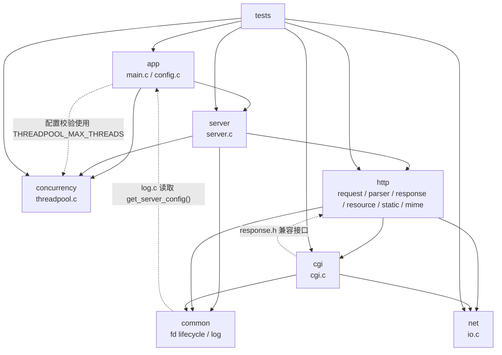
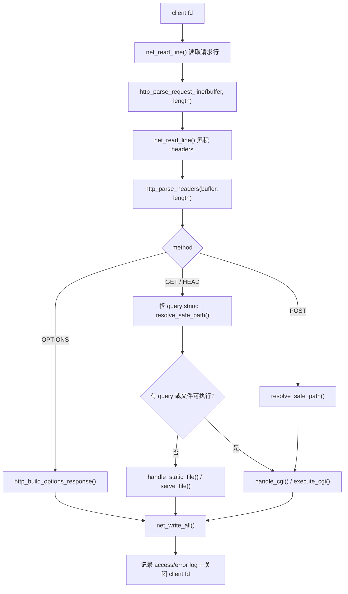

# Tinyhttpd 架构说明

## 文档范围

本文描述当前工作区中的真实实现，而不是理想化设计。事实来源是
[`src/`](../src)、[`include/`](../include)、[`Makefile`](../Makefile) 和
[`tests/`](../tests)。项目仍是一个便于学习和维护的轻量 C HTTP Server，目标是
在保留 tinyhttpd 代码规模和 HTTP/CGI 行为的前提下，提供固定线程池、配置、
日志、路径约束和可复现测试；它不是完整 HTTP/1.1 Server，也没有 TLS 或 CGI
sandbox。

## 当前模块职责

| 模块 | 主要实现 | 当前职责 |
|---|---|---|
| app | [`src/app/main.c`](../src/app/main.c)、[`src/app/config.c`](../src/app/config.c) | 读取配置、解析可选端口参数、发布进程级配置并组装 Server。 |
| server | [`src/server/server.c`](../src/server/server.c) | 创建 listener、处理信号、`poll()`/`accept()`、向线程池提交连接、关闭生命周期。 |
| concurrency | [`src/concurrency/threadpool.c`](../src/concurrency/threadpool.c) | 固定 worker、FIFO 任务队列、任务排空与 join。 |
| http | [`src/http/`](../src/http) | socket 适配、纯请求解析、路由决策、资源定位、静态文件、MIME 和响应字节构造。 |
| cgi | [`src/cgi/cgi.c`](../src/cgi/cgi.c) | CGI 环境、pipe/fork/exec、POST body 转发、CGI 输出转发、超时和回收。 |
| net | [`src/net/io.c`](../src/net/io.c) | `recv()` 行读取和 `send()` 全量写入；不解释 HTTP 语义。 |
| common | [`src/common/fd_lifecycle.c`](../src/common/fd_lifecycle.c)、[`src/common/log.c`](../src/common/log.c) | close-on-exec/fd 模式、fork 竞态窗口保护、进程级日志。 |
| tools | [`tools/simpleclient.c`](../tools/simpleclient.c)、[`tools/benchmark.c`](../tools/benchmark.c) | 历史 TCP 客户端和简单 GET 压测辅助程序，不参与 Server 运行。 |

公共接口统一位于 [`include/`](../include)。这些头文件是当前的编译边界，但并不
意味着其中所有函数都是稳定的外部库 API；项目最终交付物仍是 `httpd`、`client`
和 `benchmark` 三个可执行程序。

## 当前模块依赖图

实线表示主要运行时方向；虚线是当前真实存在、但不应继续扩大的反向或兼容依赖：

- [`src/http/request.c`](../src/http/request.c) 的 `accept_request()` 负责路由并调用
  `handle_cgi()`，而 [`src/cgi/cgi.c`](../src/cgi/cgi.c) 又通过
  [`include/response.h`](../include/response.h) 使用 HTTP 错误响应适配器。因此
  `http` 与 `cgi` 在模块级形成环，不是完全单向分层。
- [`src/common/log.c`](../src/common/log.c) 的 `log_access()` 和
  `log_error_message()` 调用 `get_server_config()`，所以 `common` 并非完全独立于
  `app`。
- [`src/app/config.c`](../src/app/config.c) 使用
  `THREADPOOL_MAX_THREADS` 校验 `thread_num`。这是合理的契约复用，但意味着配置
  模块知道并发模块的上限。
- [`include/utils.h`](../include/utils.h) 同时转引 fd、HTTP 协议、解析器和网络接口；
  [`src/server/server.c`](../src/server/server.c) 与 [`src/cgi/cgi.c`](../src/cgi/cgi.c)
  因此获得了比实际需要更宽的编译依赖。

## 主数据流

### 进程与连接生命周期

1. [`main()`](../src/app/main.c) 调用 `load_config(CONFIG_PATH, &cfg)`；缺失配置文件
   时保留内置默认值。可选的 `argv[1]` 只覆盖端口。
2. `set_server_config(&cfg)` 把配置复制到进程级 `active_config`，随后
   `server_run(cfg.port)` 启动 Server。
3. [`server_run()`](../src/server/server.c) 调用 `startup()` 创建非阻塞、
   close-on-exec listener，再用 `threadpool_init()` 创建固定 worker。
4. 主线程每 250 ms `poll()` listener；`accept_cloexec_blocking()` 返回一个阻塞的
   client fd，成功提交给 `threadpool_submit()` 后，所有权转移给任务队列/worker。
5. worker 调用 `handle_client()` 设置 5 秒 socket 读取超时，再进入
   `accept_request()`。
6. 请求处理函数或其静态文件/CGI 分支关闭 client fd。提交失败时由
   `server_run()` 关闭；线程池只保存 fd 数值，不在成功处理后额外关闭它。
7. `SIGINT`/`SIGTERM` 只把 `running` 置零。主循环退出后
   `threadpool_shutdown()` 排空已接收任务并 join worker，最后关闭 listener。

### HTTP 请求数据流

网络读取与 HTTP 解析已经分为两层：

- [`net_read_line()`](../src/net/io.c) 只把 CRLF、裸 CR 或 LF 规范成以 `\n` 结尾
  的行，并处理 `recv()`/`EINTR`/超时。
- [`http_parse_request_line()`](../src/http/parser.c) 和
  [`http_parse_headers()`](../src/http/parser.c) 接受显式的 `data + length`，不创建
  或读取 socket。
- [`parse_request_line()`](../src/http/request.c) 和
  [`read_headers()`](../src/http/request.c) 是 fd 到纯解析器的适配层，并把解析状态
  转成既有错误响应。

响应也分为构造和发送：[`src/http/response.c`](../src/http/response.c) 只写入栈上
的 `http_response_buffer_t`；调用者再用 [`net_write_all()`](../src/net/io.c) 发送。
[`src/http/response_writer.c`](../src/http/response_writer.c) 保留原来的 fd 风格函数，
供 CGI 和兼容调用者使用。

### 静态文件路径

`accept_request()` 调用 [`resolve_safe_path()`](../src/http/resource.c)，后者：

1. 拒绝 URL 中名为 `..` 的路径段；
2. 对配置的 `root_dir` 执行 `realpath()`；
3. 拼接 raw URL，并对目录补 `index.html`；
4. 对最终目标执行 `realpath()`，确认结果仍以真实 document root 为边界；
5. 返回 `stat` 信息，或立即生成并发送 400/403/404/500 响应。

非可执行普通文件进入 [`serve_file()`](../src/http/static_file.c)。该函数用
`open_cloexec()`/`fdopen()` 打开资源，调用 `http_build_static_headers()`，非 HEAD
请求再用 `fread()` 分块并通过 `net_write_all()` 发送文件内容。

### CGI 路径

GET/HEAD 带 query string，或目标文件任一执行位被设置时进入 CGI；POST 总是按 CGI
处理。[`execute_cgi()`](../src/cgi/cgi.c) 在父进程中构造环境数组，再通过
`fork_with_cloexec_pipes()` 创建两条 pipe 并 fork：

- 子进程把 CGI stdout/stdin 分别 `dup2()` 到 pipe，关闭其他 fd，恢复
  `SIGPIPE`/`SIGALRM` 默认动作，设置 5 秒 `alarm()`，然后 `execve()`。
- 父进程对 POST 先把 client body 写入 CGI stdin，再读取 CGI stdout。读到第一个
  字节后才发送 `HTTP/1.0 200 OK` 和 `SERVER_STRING`。
- HEAD 只转发到 `\n\n` 或 `\r\n\r\n` 为止，随后读取并丢弃 body；其他方法转发
  全部 CGI 输出。
- 父进程关闭 pipe、`waitpid()` 回收子进程并关闭 client fd。

## 关键设计决策

### 1. 保留 HTTP/1.0 与短连接行为

静态和错误响应由 [`http_build_static_headers()`](../src/http/response.c) 与
`http_build_error_response()` 明确产生 `HTTP/1.0` 和 `Connection: close`。Server
没有 keep-alive 状态机；每个连接只处理一次请求并关闭。这是兼容性约束，不应在
普通整理中改变。

### 2. 纯解析/构造核心，薄 fd 适配层

[`include/http_parser.h`](../include/http_parser.h) 与
[`include/http_response.h`](../include/http_response.h) 不依赖 socket。独立测试
[`tests/http_parser_test.c`](../tests/http_parser_test.c) 和
[`tests/http_response_test.c`](../tests/http_response_test.c) 直接锁定缓冲区输入输出。
fd 适配保留在 `request.c`、`response_writer.c`、`static_file.c` 和 `cgi.c`。

### 3. 固定线程池，不改变调度模型

[`threadpool_t`](../src/concurrency/threadpool.c) 是一个进程级实例，使用 mutex、
condition variable 和单链 FIFO 队列。队列大小固定传入
`DEFAULT_QUEUE_SIZE`（1000）；shutdown 停止接收新任务，但 worker 会先排空队列。

### 4. 通过短期全局锁缩小 fork/fd 继承竞态

[`fork_fd_mutex`](../src/common/fd_lifecycle.c) 让 accept、pipe+fork 和 Server 内部
open 的“创建 fd + 设置 close-on-exec”窗口互斥。CGI 子进程还在 exec 前关闭
3 到 `_SC_OPEN_MAX` 的 fd。这个方案针对当前 pthread + fork 模型，不应在没有并发
CGI 回归测试的情况下替换。

### 5. 配置和日志是进程级服务

[`active_config`](../src/app/config.c) 在 `main()` 发布后只读；日志用单独 mutex
串行追加。日志失败是 best-effort：`log_access()`/`log_error_message()` 不把打开或
写入失败传播到 HTTP 响应。

## 共享状态与副作用

| 状态/副作用 | 所有者 | 生命周期与约束 |
|---|---|---|
| `active_config`、`active_config_initialized` | `src/app/config.c` | 进程全程；启动后按只读使用，没有锁。 |
| `running` | `src/server/server.c` | `sig_atomic_t`；信号处理器只写零，主循环读取。 |
| `pool`、`lifecycle_mutex`、`processed_count` | `src/concurrency/threadpool.c` | `threadpool_init()` 到 `threadpool_shutdown()`；计数使用原子内建。 |
| `fork_fd_mutex` | `src/common/fd_lifecycle.c` | 进程全程；串行化 fd 创建/标记与 fork。 |
| `log_mutex` | `src/common/log.c` | 进程全程；保护目录创建和单条日志追加。 |
| `environ` | `src/cgi/cgi.c` | 读取宿主进程环境，过滤并覆盖三个 CGI 变量。 |
| 文件系统 | `resource.c`、`static_file.c`、`log.c` | `realpath/stat/open/fread` 读取内容；日志创建 `logs/` 并追加文件。 |
| 进程与信号 | `server.c`、`cgi.c` | 安装进程信号处理器；每次 CGI fork/exec 子进程并 `waitpid()`。 |

## 依赖方向约束

后续修改应遵守以下约束：

1. `app -> server`，入口只做配置、参数和生命周期组装；业务解析不得回到 `main.c`。
2. `server -> concurrency + request adapter + fd lifecycle`；Server 不解析 HTTP、
   不定位资源、不执行 CGI。
3. 纯 `http/parser.c` 和 `http/response.c` 不得依赖 `net_io.h`、socket、配置、日志、
   CGI 或线程池。
4. `net` 只表达字节 I/O；不得根据 HTTP 状态码、方法、header 或文件类型分支。
5. `concurrency` 只持有 `client_fd` 和 handler；不得 include HTTP/CGI/配置实现。
6. `cgi` 可以使用 HTTP 响应字节或适配接口，但不应依赖 Server 主循环或线程池。
7. 不要继续向 `utils.h` 添加不相关接口；新代码应 include 最窄的专用头文件。
8. 当前 `http <-> cgi` 和 `common/log -> app/config` 是已知例外。若要消除，必须先
   为错误响应、访问日志和 CGI 失败语义增加行为测试，再作为独立阶段处理。

## 与现有说明的差异

- [`TESTING.md`](../TESTING.md)、
  [`http_build_options_response()`](../src/http/response.c)、
  [`tests/http_response_test.c`](../tests/http_response_test.c) 和
  [`tests/run_integration_tests.sh`](../tests/run_integration_tests.sh) 当前一致锁定
  OPTIONS `Allow` 为 `GET, POST, HEAD, OPTIONS`。
- [`README.md`](../README.md) 的手工命令使用 8080，是“配置文件缺失时”的默认值。
  当前运行若存在 `config/server.conf`，其中的 `port` 和 `root_dir` 会生效；命令行
  参数只覆盖端口，不会恢复默认 document root。
