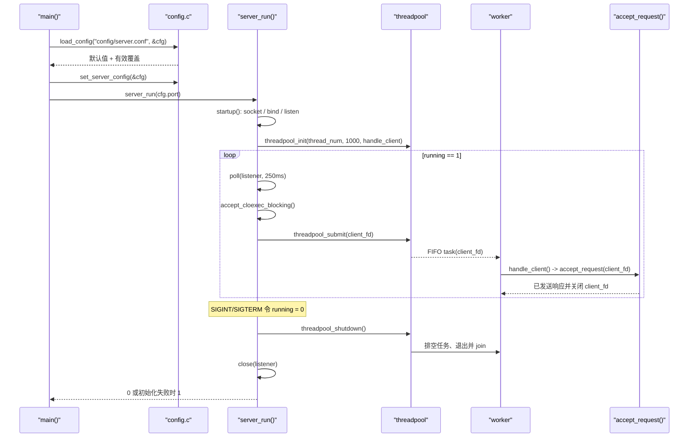
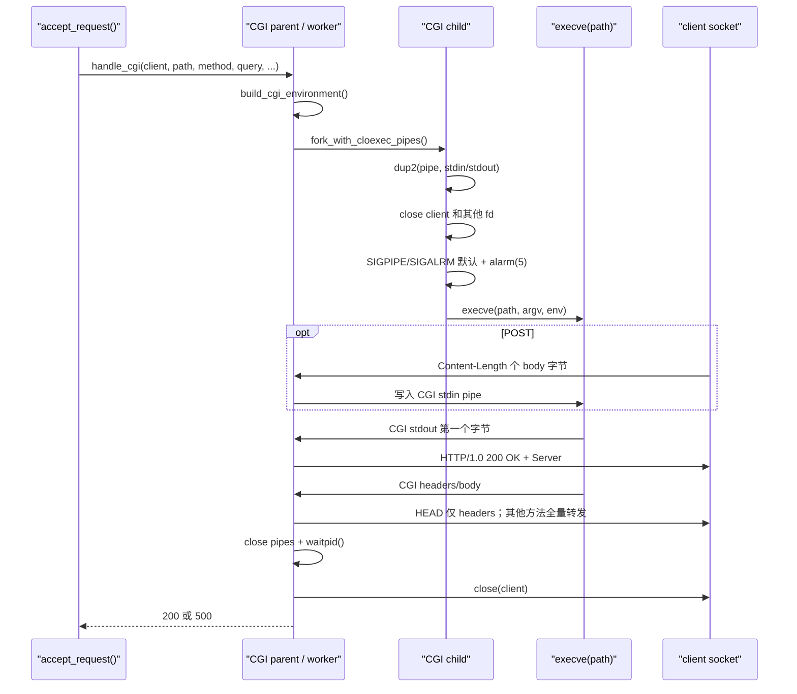

# Tinyhttpd 代码执行导览

## 从 `main()` 开始

程序入口是 [`src/app/main.c`](../src/app/main.c) 的 `main()`：

```text
main
  -> load_config(CONFIG_PATH, &cfg)
  -> parse_port(argv[1], &cfg.port)       # 仅当提供命令行参数
  -> set_server_config(&cfg)
  -> server_run(cfg.port)
```

`load_config()` 总是先调用 `init_default_config()`，默认端口 8080、4 个 worker、
`./htdocs` 根目录并启用两类日志。配置文件不存在不是错误；无效配置项打印 warning
并对该项使用默认值。[`parse_port()`](../src/app/main.c) 只接受 1 到 65535；无效命令行
端口不会让进程退出，而是把端口设为 8080。`main()` 最终原样返回
`server_run()` 的退出码。

## 启动、接收与关闭时序



### `startup()` 做了什么

[`startup()`](../src/server/server.c) 创建 `PF_INET/SOCK_STREAM` socket，调用
`set_cloexec()` 和 `set_nonblocking()`，设置 `SO_REUSEADDR`，绑定 `INADDR_ANY`，
再以 backlog 5 监听。虽然函数保留了 `*port == 0` 的动态端口分支，但当前配置与
命令行校验都不允许端口零，因此正常入口不会走到该分支。

`socket()`、`fcntl()`、`bind()`、`listen()` 等启动错误通过
[`error_die()`](../src/common/fd_lifecycle.c) 执行 `perror()` 后 `exit(1)`。与之不同，
线程池初始化失败由 `server_run()` 关闭 listener 并返回 1。

### listener 与 client fd

listener 保持非阻塞，以便主线程通过 250 ms `poll()` 观察 `running`。接受连接时，
[`accept_cloexec_blocking()`](../src/common/fd_lifecycle.c) 在 `fork_fd_mutex` 保护下：

1. `accept()` 新 fd；
2. 设置 `FD_CLOEXEC`；
3. 清除 `O_NONBLOCK`，让 client fd 使用阻塞 I/O；
4. 把 fd 返回给 `server_run()`。

若 `threadpool_submit()` 成功，fd 所有权转交任务队列；若队列满、shutdown、未初始化
或内存分配失败，提交返回 -1，`server_run()` 立即 `close(client_sock)`。

## 一个请求如何处理

线程池 worker 调用 [`handle_client()`](../src/server/server.c)，先给 client socket
设置 5 秒 `SO_RCVTIMEO`，随后调用 [`accept_request()`](../src/http/request.c)。

### 阶段 1：识别客户端和读取请求行

`accept_request()` 先通过 `getpeername()`/`inet_ntop()` 获取 IPv4 字符串，失败时使用
`-`。然后调用 `parse_request_line(client, method, ..., url, ...)`：

1. [`net_read_line()`](../src/net/io.c) 用 `recv()` 每次读一个字节，处理 `EINTR`，
   把 CRLF/CR/LF 规范成单个 `\n`；超时打印 `[timeout]` 并返回 -1。
2. [`http_parse_request_line()`](../src/http/parser.c) 从显式 buffer/length 提取 method
   和 URL，方法大小写不敏感。
3. 支持 `GET`、`POST`、`HEAD`、`OPTIONS`；缺失或格式错误为 400，不支持的方法为
   501，URL 超过调用方 255 字节缓冲边界为 414。
4. fd 适配器把正状态码转换成既有错误响应；读取失败/EOF 返回 -1，不发送额外响应。

请求行成功后，原始 URL 被复制到 `access_url`。后续 GET query 会原地把 URL 的 `?`
改成 `\0`，访问日志仍使用未修改的副本。

### 阶段 2：读取并解析 headers

[`read_headers()`](../src/http/request.c) 循环调用 `net_read_line()`，将各行累积到
最多 8 KiB 的 buffer。每加入一行就立即调用
[`http_parse_headers()`](../src/http/parser.c)，因此重复 `Content-Length` 不必等待空行
就能返回 400。

当前 header 解析器只提取 `Content-Length`：

- 缺失时保持 -1；
- 重复、负数、非十进制尾随字符返回 400；
- 大于 `MAX_REQUEST_SIZE`（1 MiB）返回 413；
- 单行达到 1023 字节且没有换行由 fd 适配器返回 400；
- 累计 header 超过 8 KiB 返回 413；
- 其他 header 被接受但不保存。

`http_parse_headers()` 的 API 带显式长度，但内部仍使用 C 字符串操作处理字段；不应
把它理解成任意二进制数据解析器。

### 阶段 3：方法分派与资源定位

```text
accept_request
  -> OPTIONS: http_build_options_response -> net_write_all -> close
  -> GET/HEAD:
       split '?' -> resolve_safe_path
       -> query 存在或文件可执行: handle_cgi
       -> 否则: handle_static_file
  -> POST:
       resolve_safe_path -> handle_cgi
  -> log_request_error + log_access
```

解析器已经拒绝其他方法，因此最后的 `else` 实际代表 POST。

[`resolve_safe_path()`](../src/http/resource.c) 接收 client fd 的原因是它当前会直接发送
400/403/404/500；它同时返回状态码给 `accept_request()` 用于日志。函数对 raw URL 做
`..` 路径段检查，再以 `realpath()` 后的 document root 检查最终目标没有逃逸。
目录自动追加 `index.html`。

GET/HEAD 的 query string 会强制 CGI。没有 query 时，只要目标文件的 user/group/other
任一执行位存在，也会按 CGI 执行。POST 不检查扩展名或执行位，定位成功后直接尝试
CGI 执行；`execve()` 失败最终产生 500。

## 静态文件分支

[`handle_static_file()`](../src/http/static_file.c) 只是
`serve_file(client, path, is_head, file_size)` 的命名入口。`serve_file()` 的顺序是：

1. `open_cloexec(filename, O_RDONLY, 0)` 打开文件；权限错误构造 403，其他打开错误
   构造 404。
2. `fdopen()` 把文件 fd 交给 `FILE *resource`；失败时关闭原 fd并返回 404。
3. `http_build_static_headers()` 依据 [`get_mime_type()`](../src/http/mime.c) 构造
   `HTTP/1.0 200 OK`、Server、Content-Type、Content-Length、Connection close。
4. `net_write_all()` 发送 header。
5. 非 HEAD 时，[`cat()`](../src/http/static_file.c) 反复 `fread()` 4 KiB 并发送；
   因为使用显式长度，文件中的 NUL 不会截断。
6. `fclose(resource)` 关闭文件 fd，`close(client)` 关闭连接，返回 200。

当前实现若中途发送 body 失败，`cat()` 只停止循环，`serve_file()` 仍返回 200；访问
日志反映选中的 HTTP 路径，而不是客户端是否完整收到所有字节。

## CGI 分支

[`handle_cgi()`](../src/cgi/cgi.c) 先验证 POST `Content-Length`：缺失为 400，超过
1 MiB 为 413，然后调用 `execute_cgi()`；后者为防御性目的重复相同验证。

### CGI 环境

`build_cgi_environment()` 读取全局 `environ`，保留原环境中除
`REQUEST_METHOD`、`QUERY_STRING`、`CONTENT_LENGTH` 外的指针，再追加：

- 所有 CGI：`REQUEST_METHOD=<method>`；
- POST：`CONTENT_LENGTH=<length>`；
- GET/HEAD：`QUERY_STRING=<query-or-empty>`。

新分配的只是 `char **` 指针数组；字符串来自原 `environ` 或 `execute_cgi()` 栈上
buffer。父进程在 fork 后释放数组，子进程在 exec 前继续使用其 fork 副本。

### pipe、fork 与数据转发



父进程对 POST 把 socket 读取超时缩短为 1 秒，并严格读取声明的 body 字节数。提前
EOF、超时或异常时杀死并回收 CGI，返回 400。写 pipe 失败则返回 500。非 POST 会
立即关闭 CGI stdin 的写端。

在收到 CGI 输出第一个字节前，Server 尚未向客户端发送 200；若没有任何输出，能
返回完整 500 错误页。一旦第一个字节到达，Server 先发送固定 200 和 Server header，
再原样转发脚本输出。若脚本随后非零退出，调用链返回并记录 500，但已发送的 200
无法撤回。这是当前已确认行为，不应在普通重构中“修正”。

## 响应构造与发送

[`http_response_buffer_t`](../include/http_response.h) 是固定 8192 字节的栈上结构：

```c
typedef struct {
    char data[HTTP_RESPONSE_CAPACITY];
    size_t length;
} http_response_buffer_t;
```

[`src/http/response.c`](../src/http/response.c) 的三个纯构造入口分别处理静态 header、
错误页和 OPTIONS。它们不调用 `send()`。发送责任在调用方：

- `request.c`、`resource.c`、`static_file.c` 调用 `net_write_all()`；
- [`response_writer.c`](../src/http/response_writer.c) 把旧的 `bad_request()`、
  `cannot_execute()`、`headers()` 等 fd API 适配到 builder + `net_write_all()`；
- `cgi.c` 仍通过兼容的 `send_all()` 转发 CGI 数据。

OPTIONS 的真实 `Allow` 顺序是 `GET, POST, HEAD, OPTIONS`，并同样用于 CORS
`Access-Control-Allow-Methods`。

## 资源所有权

| 资源 | 创建者 | 正常所有权转移 | 释放者 |
|---|---|---|---|
| `server_config_t cfg` | `main()` 栈 | `set_server_config()` 复制 | 栈自动释放；全局副本存活到进程退出 |
| 配置 `FILE *` | `load_config()` | 无 | `load_config()` 的 `fclose()` |
| listener fd | `startup()` | 返回给 `server_run()` | `server_run()`；致命启动错误直接退出进程 |
| accepted client fd | `server_run()` | 成功 submit 后交给任务/worker | submit 失败由 Server 关闭；成功路径由请求/静态/CGI处理关闭 |
| `threadpool_task_t` | `threadpool_submit()` | FIFO 队列到 worker | worker 调 handler 后 `free()` |
| worker 数组/线程 | `threadpool_init()` | `pool` | `threadpool_shutdown()` join/free |
| 静态文件 fd/`FILE *` | `serve_file()` | fd 交给 `fdopen()` | 失败分支 `close(fd)`；成功 `fclose(resource)` |
| 响应 buffer | 各调用者栈 | 只借用给 builder/发送函数 | 栈自动释放 |
| CGI 环境指针数组 | `build_cgi_environment()` | fork 后父子各有副本 | 父进程 `free()`；子进程由 `execve()`/`_exit()` 回收 |
| 两组 CGI pipe | `fork_with_cloexec_pipes()` | fork 后父子各关无用端 | `execute_cgi()` 每个分支关闭；进程退出兜底 |
| CGI 子进程 | `fork_with_cloexec_pipes()` | 父进程负责回收 | `wait_for_child()`；错误路径可能先 `SIGKILL` |
| 日志 `FILE *` | `log_access()`/`log_error_message()` | 无 | 同一函数内 `fclose()` |

维护 client fd 时要特别小心：当前契约是“每个终止分支恰好关闭一次”。线程池并不
兜底关闭成功提交的连接；若新增 handler 提前返回而不 close，会直接泄漏 fd。

## 错误如何传播

| 位置 | 表达方式 | 上层行为 |
|---|---|---|
| 配置解析 | warning + 保留/恢复默认，`load_config()` 返回 0 | Server 继续启动 |
| listener 创建/绑定/监听 | `error_die()` | `perror()`，进程 `exit(1)` |
| 线程池初始化 | 返回 -1 | 关闭 listener，`server_run()` 返回 1 |
| poll 异常 | `perror()` 后跳出循环 | 排空线程池、关闭 listener，当前仍返回 0 |
| accept 非暂态错误 | `error_die()` | 进程 `exit(1)` |
| 队列拒绝 | `threadpool_submit()` 返回 -1 | Server 关闭连接，不发送 HTTP 响应 |
| 请求读取失败/EOF | -1 | 关闭连接，通常不写 access log |
| HTTP 格式/大小 | 400/413/414/501 | 生成固定错误响应、记录 access log、关闭连接 |
| 资源定位/打开 | 400/403/404/500 | 立即发送错误响应；请求层记录 access/error log |
| CGI 启动/body/退出 | 400/413/500 | 尽可能发送错误页；已发 200 时只能记录 500 |
| 网络写失败 | 多数返回 -1，但部分调用者忽略 | 关闭本地资源/连接；日志状态可能仍是原状态 |
| 日志失败 | 内部静默忽略 | 不改变 HTTP 结果 |

## 关闭流程

信号处理器 [`shutdown_handler()`](../src/server/server.c) 只执行异步信号安全的
`running = 0`。listener 的 250 ms poll 超时保证主线程很快重新检查标志。
`threadpool_shutdown()` 设置 `pool.shutdown`、唤醒全部 worker，然后 join；worker
只有在队列为空且 shutdown 已设置时退出，因此已成功提交的连接会被处理完。最后
`server_run()` 关闭 listener 并返回 0。

CGI worker 可能一直执行到脚本的 5 秒 alarm 结束；shutdown 不强杀 worker 或已接收
请求。这个“先排空再退出”行为由
[`tests/run_integration_tests.sh`](../tests/run_integration_tests.sh) 的 busy-worker
SIGTERM 场景锁定。
